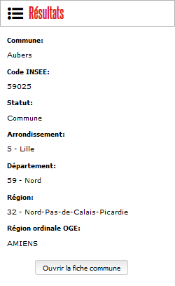
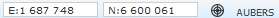
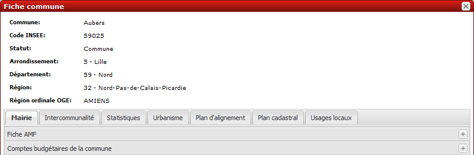
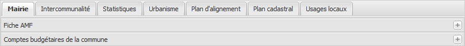
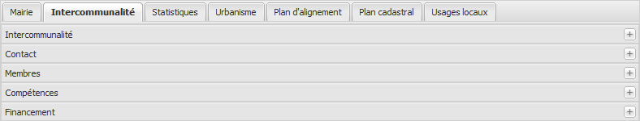
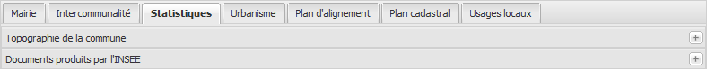
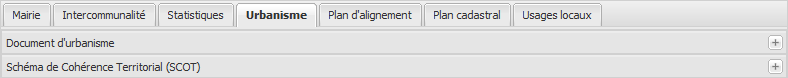
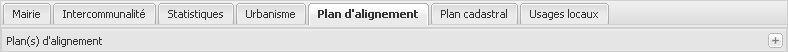
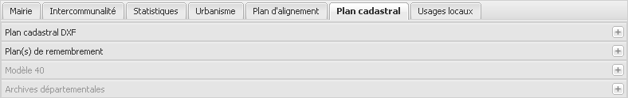
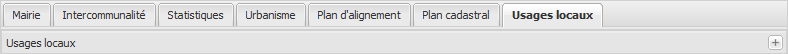

Informations communales
=======================

Géofoncier vous permet d’accéder à toute une série d’informations alphanumériques concernant toutes les communes de France.

.. note:: En fonction de la commune considérée, certaines informations peuvent ne pas être disponibles.

Pour accéder à ces informations, deux moyens sont à votre disposition :

* Lors d’une localisation d’une commune avec demande d’affichage des informations communale (cf section 3.3.3), une fiche sommaire se charge dans le volet «Résultats». Cette fiche informe du code INSEE de la commune, de son statut, de l’arrondissement, du département, de la région et de la région ordinale de l’OGE à laquelle elle appartient.

Il suffit alors de cliquer sur le bouton «Ouvrir la fiche commune» pour accéder à des informations complémentaires.

* Cliquer sur le nom de la commune qui apparait aux grandes échelles en bas à droite de l’affichage des coordonnées du curseur de la souris.

Le nom de la commune apparaît à partir du 1/7500.

Une fenêtre «Fiche commune» s’affiche alors à l’écran. L’en-tête récapitule les informations sommaires sur la commune. Une barre d’onglets vous propose alors d’accéder à des informations thématiques.

Après avoir sélectionné un onglet, un clic sur le nom d’une rubrique provoque l’affichage des informations (|ico_plus|).

Thème «Mairie»
--------------

**Fiche AMF** :

	Adresse et coordonnées de la mairie.

	*Source de données : site de l’Association des Maires de France*

**Comptes budgétaire de la commune** :

	Données budgétaire issues du Ministère des finances (depuis 2000).

	*Source de données : connexion avec le serveur Alize2 du Ministère des finances.*

Thème «Intercommunalité »
-------------------------

**Intercommunalité** :

	Informations sur le type de structure intercommunale.

	*Source de données: fichier BANATIC F (DGCL Ministère de l’intérieur)*

**Contact** :

	Identification et coordonnées du président de la structure intercommunale.

	*Source de données: fichier BANATIC F (DGCL Ministère de l’intérieur)*

**Membres** :

	Listes des communes membres de la structure intercommunale.

	*Source de données: fichier BANATIC F (DGCL Ministère de l’intérieur)*

**Compétences** :

	Listes des compétences de la structure intercommunale.

	*Source de données: fichier BANATIC F (DGCL Ministère de l’intérieur)*

**Financement** :

	Mode de financement de la structure intercommunale.

	*Source de données: fichier BANATIC F (DGCL Ministère de l’intérieur)*

.. note:: Les informations présentes dans cet onglet sont mises à jour annuellement.

Thème «Statistiques»
--------------------

**Topographie de la commune** :

	Données topographique sommaire sur le territoire communal.

	*Source de données: fichier RGC (IGN)*

**Documents produits par l’INSEE** :

	Liens vers des documents PDF produit par l’INSEE: résumé statistique et dossier statistique.

	*Source de données: INSEE*

Thème «Urbanisme»
------------------

**Document d’urbanisme** :

	Etat du document d’urbanisme.

	*Source de données: Observatoire des territoires (DATAR)*

**Schéma de Cohérence Territoriale (SCOT)** :

	Le cas échéant, information sur le SCOT auquel appartient la commune.

	*Source de données: Observatoire des territoires (DATAR)*

**Documents annexes au document d’urbanisme** :

	Le cas échéant, liens vers les documents annexes au document d’urbanisme (PDF).

**Pays** :

	Le cas échéant, information sur le Pays auquel appartient la commune.

	*Source de données: Observatoire des territoires (DATAR)*

**Loi littoral** :

	Le cas échéant, information sur le classement en loi littoral.

	*Source de données: Observatoire des territoires (DATAR)*

**Zone de revitalisation rurale** :

	Le cas échéant, information sur le classement en zone de revitalisation rurale.

	*Source de données: Observatoire des territoires (DATAR)*

.. note:: Les informations présentes dans cet onglet sont mises à jour annuellement.

.. note:: En fonction de la commune considérée, certaines rubriques peuvent être absentes.

Thème «Plans d’alignement»
--------------------------

**Plan(s) d’alignement** :

	Le cas échéant, liens vers des versions PDF des plans d’alignement sur la commune.

.. note:: Lorsque les plans d’alignement ne sont pas disponibles sur une commune, la rubrique apparaît en grisé.

Thème «Plan cadastral»
----------------------

.. tip:: Lorsque les éléments d’une rubrique ne sont pas disponible, la rubrique apparaît en grisé.

**Plan Cadastral DXF** :

	Le cas échéant, téléchargement d’une archive zip contenant le plan cadastral PCI-DXF de la commune.

	*Source de données: partenariats locaux OGE / DGFiP*

.. note:: Disponible uniquement pour les communes pour lesquelles l’OGE est partenaire des conventions de numérisation du plan cadastral.

**Plan(s) de remembrement** :

	Le cas échéant, liens vers des versions PDF des plans côtés de remembrement.

	*Source de données: partenariat locaux OGE / DGFiP*

.. tip:: Les géomètres-experts auteurs de plan de remembrement peuvent, s’ils le souhaitent, les publier sur Géofoncier. Il suffit pour cela de se faire connaitre en écrivant à contact@geofoncier.fr

**Modèles 40** :

	Le cas échéant, liens vers des versions PDF des modèles 40 de la commune.

.. tip:: Les modèles 40 permettent notamment de connaître le géomètre-expert auteur d’un document d’arpentage réalisé sur la commune.

**Archives départementales** :

	Le cas échéant, liens vers les sites des archives départementales lorsqu’elles proposent la consultation en ligne de plan cadastraux anciens: plans «napoléoniens» notamment.

Thème «Usages locaux»
---------------------

**Usages locaux** :

	Le cas échéant, liens vers des versions PDF des recueils des usages locaux concernant la commune.

	*Source de données: recensement ESGT*

.. note:: Les géomètres-experts disposant de recueils d’usages locaux et souhaitant les publier sur Géofoncier sont invités à écrire à contact@geofoncier.fr

