Connexion à Géofoncier
======================

Pour utiliser le portail Géofoncier, vous devez disposer à minima d’un micro-ordinateur muni d’un navigateur internet et d’une connexion Internet. Il n’y a pas de contraintes particulières quant au type de matériel informatique à utiliser.

Pré-requis matériels et logiciels
---------------------------------

Géofoncier fonctionne sur tout ordinateur capable de se connecter à Internet et disposant d’un navigateur web. Il n’y pas de contrainte matérielle particulière pour pouvoir accéder au portail. Néanmoins, il convient de disposer d’une machine suffisamment puissante (processeur, mémoire vive). Tout ordinateur **classique** du marché destiné à un usage bureautique convient parfaitement à cet usage.

Géofoncier s’exécute indifféremment sous environnement PC ou MAC. L’application fonctionne avec les principaux systèmes d’exploitation du marché: Microsoft Windows, Mac OS, Linux (pour ne citer que les plus connus d’entre eux).

Connexion Internet
^^^^^^^^^^^^^^^^^^

Pour une utilisation optimale de Géofoncier, il est recommandé de disposer d’une connexion de type ADSL avec un débit descendant de 1024k ou plus. Un débit descendant de 512 k semble être le minimum requis pour une utilisation confortable de Géofoncier (temps de chargement acceptable, bonne réactivité de l’application).

Les connexions par modem 56 k transitant par le réseau téléphonique n’offrent pas des temps de chargement suffisamment courts, si bien que l’application manque cruellement de réactivité. Même si théoriquement rien ne s’oppose à utiliser Géofoncier avec ce type de connexion, cela est très vivement déconseillé.

Configuration de l’écran
^^^^^^^^^^^^^^^^^^^^^^^^

Géofoncier est une application web (simple page internet). A ce titre, il n’y a pas de contraintes particulières quant à la résolution de l’écran à utiliser pour accéder au site. L’usage montre toutefois qu’il est plus confortable d’utiliser le portail avec un écran de forme **standard** (écrans **rectangulaires** type 16/9 ou autres à éviter). Une résolution convenable d’utilisation est, par exemple, 1280 x 1024 pixels.

Bien que toujours possible, une utilisation de Géofoncier avec des résolutions d’écran non standard peut provoquer quelques désagréments comme le masquage de certaines parties de l’interface qui deviennent alors inaccessibles.

Navigateur
^^^^^^^^^^

Pour se connecter à Géofoncier il faut s’assurer de disposer d’un navigateur compatible. Les navigateurs pris en charge actuellement sont:

* Mozilla Firefox version 49 ou supérieure

* Microsoft Internet Explorer version 54 ou supérieure

* Google Chrome version 5 ou supérieure

* Safari version 10

.. note:: Pour connaître la version de votre navigateur, cliquer sur **?** puis sur **A propos**

Il est recommandé d’utiliser le navigateur Mozilla Firefox, logiciel libre disponible en téléchargement gratuit à cette adresse: `<http://www.mozilla-europe.org/fr/firefox/>`_ ou le logiciel Google
Chrome, logiciel disponible en téléchargement gratuit à cette adresse: `<https://www.google.fr/chrome/browser/desktop/>`_

D'une façon générale il est déconseillé d’utiliser le navigateur Internet Explorer (lui préférer par exemple le navigateur Mozilla Firefox).

Exécution des scripts JavaScript
^^^^^^^^^^^^^^^^^^^^^^^^^^^^^^^^

Votre navigateur doit accepter l’exécution des scripts JavaScript. Si tel n’est pas le cas, il vous faut configurer les options de votre navigateur. La configuration par défaut des navigateurs permet systématiquement l’exécution des scripts JavaScript.

Autorisation des pop-up
^^^^^^^^^^^^^^^^^^^^^^^

Une fois le navigateur installé et configuré sur votre poste, il convient d’autoriser les pop-up pour le site \*.geofoncier.fr.

.. note:: Les pop-up sont des fenêtres dont l’ouverture est déclenchée par l’application.

Si vous utilisez Firefox:

1. Aller dans le menu Outils >> Options

2. Cliquer sur la rubrique **Contenu** dans la colonne de gauche

3. En face de **Bloquer les fenêtres pop-up** cliquer sur **Exceptions**

4. Dans la nouvelle fenêtre rubrique **Adresse du site web** taper **pro.geofoncier.fr** puis cliquer sur **Autoriser** puis sur **Enregistrer les modifications**.

Si vous utilisez Chrome:

1. En haut à droite, cliquer sur l’icône qui s’affiche: Menu |menu| ou Plus |plus| 

.. |menu| image:: _static/images/image024.gif
   :align: middle
   :width: 18
.. |plus| image:: _static/images/image026.gif
   :align: middle
   :width: 18

2. Cliquer sur **Paramètres**

3. En bas de page, cliquer sur **Afficher les paramètres avancés**

4. Sous *Confidentialité*, cliquer sur **Paramètres de contenu**

5. Dans la rubrique ``Fenêtres pop-up``, cliquer sur ``Gérer les exceptions``

6. Ajouter l’adresse ``pro.geofoncier.fr`` dans la rubrique ``Modèle du nom d’hôte`` et sélectionner l’action *Autoriser*, puis cliquer sur **OK** sur les deux fenêtres.

Ces manipulations qui viennent d’être décrites ne sont pas obligatoires mais, en leurs absences, dès que l’application tentera d’ouvrir une page, le navigateur la bloquera systématiquement et affichera une notification.

Dès lors, il vous sera possible d’autoriser les pop-up pour le site pro.geofoncier.fr en effectuant la manipulation suivante:

* Sous Firefox: un bandeau jaune s’affiche, cliquer sur ``Options`` puis ``autoriser les pop-up pour geofoncier.fr``.

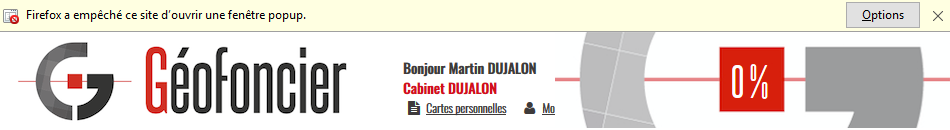

* Sous Chrome: un message à droite de la barre d’adresse s’affiche, cliquer dessus puis sélectionner l’option **Toujours afficher les fenêtres pop-up de https://pro.geofoncier.fr** puis valider avec OK

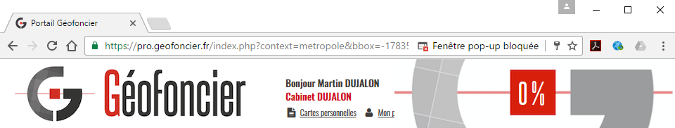

Lecteur Acrobat Reader
^^^^^^^^^^^^^^^^^^^^^^

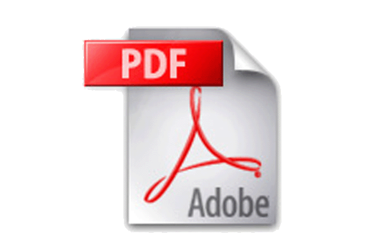

Géofoncier vous permet de générer des documents PDF. Pour pouvoir les ouvrir afin de les visualiser, les imprimer ou encore les enregistrer sur votre disque dur, il vous faut disposer du lecteur Adobe Acrobat Reader. Ce logiciel est disponible en téléchargement gratuit à cette adresse: `<http://get.adobe.com/fr/reader/>`_

Lorsque Géofoncier génère un document PDF,

* Sous Firefox, une fenêtre pop-up s’affiche à la fin du téléchargement.

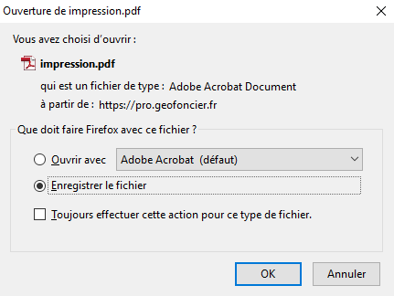

Il est alors possible d’ouvrir en lecture seule ou d’enregistrer lefichier.

* Sous Chrome, un bandeau s’affiche en bas de page à la fin du téléchargement.

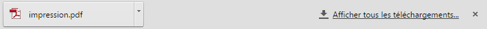

En cliquant sur le bouton ``impression.pdf``, un nouvel onglet s’ouvre.
Plusieurs actions sont alors possibles.

Lorsque Géofoncier génère un document PDF, celui-ci est automatiquement ouvert dans un autre onglet, plusieurs actions, décrites ci-dessous, sont alors possibles.

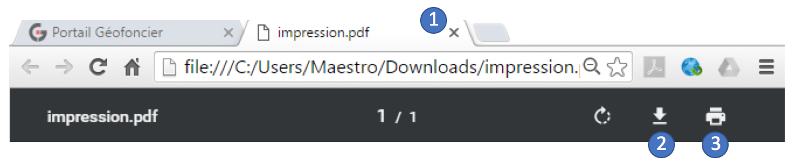

1. Fermeture du PDF et retour dans Géofoncier

2. Enregistrement du PDF sur votre ordinateur

3. Impression papier du PDF

Disponibilité du service
^^^^^^^^^^^^^^^^^^^^^^^^

Le portail Géofoncier est accessible 24h/24 7j/7. Lors des opérations de maintenance, le site devient momentanément inaccessible et un message vous informe de la non-disponibilité temporaire du service.

L’URL pour se connecter au portail Géofoncier est la suivante : `<https://pro.geofoncier.fr>`_ 

.. note:: Pour se connecter au site grand public, l’URL est la suivante : `<http://www.geofoncier.fr>`_

.. note:: Vous pouvez mémoriser l’adresse de Géofoncier en ajoutant le lien dans vos favoris:
	
	* sous Firefox : Marque–pages >> Marquer cette page

	* sous Chrome : cliquer sur l’étoile à droite de la barre d’adresse une fois connecté sur le portail. L’étoile s’affiche alors en jaune.
	
	.. image:: _static/images/image045.png
   		:alt: Favoris
   		:align: center

Ouverture d’un compte sur Géofoncier
------------------------------------

Tout membre en exercice inscrit au tableau de l’Ordre des Géomètres-Experts dispose d'un compte d’accès à Géofoncier. Lors de sa première connexion, le géomètre-expert doit saisir son numéro d’inscription au tableau de l’Ordre (identifiant composé de cinq chiffres) et le mot de passe qu’il a reçu sur sa boîte mail normalisée (mail automatique envoyé par Géofoncier à tout nouvel inscrit au tableau de l'ordre).
Une fois les informations saisies, il faut lancer la connexion en cliquant sur **Connexion**.

.. warning::
	* Attention à bien veiller à respecter les majuscules et minuscules pour la saisie du mot de passe.

	* Attention à ne pas confondre votre numéro d’inscription avec l’identifiant de votre cabinet (11 caractères). Ce dernier n’est pas reconnu par Géofoncier.

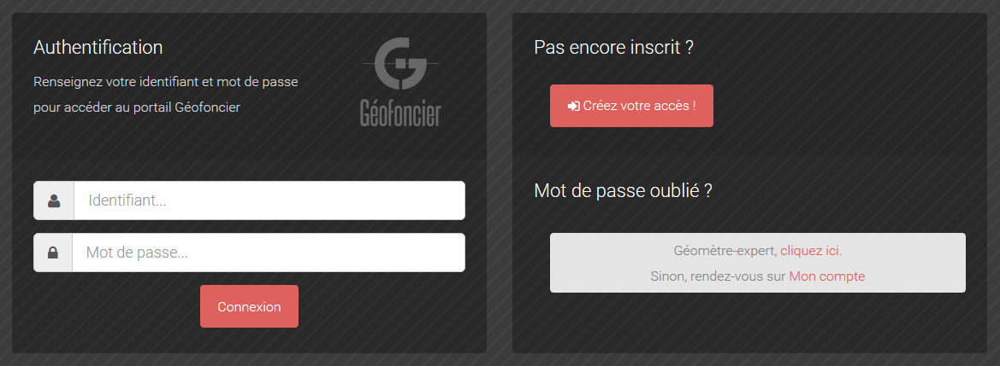

Si les identifiants rentrés sont incorrects il vous faut vérifier votre numéro national et/ou votre mot de passe.

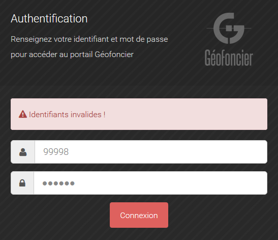

Lorsque les informations saisies sont correctes, un écran d’avertissement s’affiche, vous invitant à accepter les conditions d’utilisation du portail Géofoncier (bouton ``Accepter``).

Cet écran apparaît uniquement lors de votre première connexion, l’acceptation de cet écran vaut une fois pour toutes. Vous disposez toutefois de la possibilité de le réafficher par la suite, à tout moment, en cliquant sur le lien ``Avertissement`` (cf. section 3.3.9).

Après avoir lu et accepté les conditions d’utilisation, la connexion au portail Géofoncier sur le territoire ``France métropolitaine`` est automatique.

.. note:: Les utilisateurs souhaitant changer de territoire sont invités à prendre connaissance de la procédure à la section 4.1.9.

Se connecter
------------

Pour vous connecter, 2 solutions sont possibles:

* En passant directement par l’adresse du portail ``https://pro.geofoncier.fr``, il suffit de saisir sur cette page votre identifiant et votre mot de passe dans les deux champs prévus à cet effet.

* En passant via le site ``https://www.geofoncier.fr``, et en cliquant dans la barre de menu sur le bouton ``Accéder au portail``. En cliquant sur ce lien, on arrive sur la page du portail ``https://pro.geofoncier.fr``

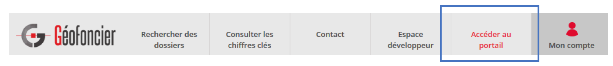

**Que faire en cas d’oubli du mot de passe?**

En cas d’oubli du mot de passe, en tant que géomètre-expert, il suffit de cliquer sur ``cliquer ici``

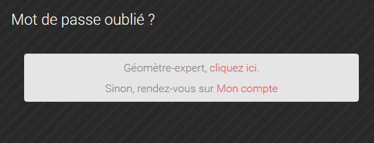

Une fenêtre pop-up s’affiche et vous invite à renseigner votre numéro de géomètre-expert (à 5 chiffres) ainsi que votre courriel (courriel normalisé transmise par l’OGE sous la forme @geometre-expert.fr). Un nouveau mot de passe vous sera transmis par mail. Ce mot de passe pourra être ensuite changé (cf. section 2.4).

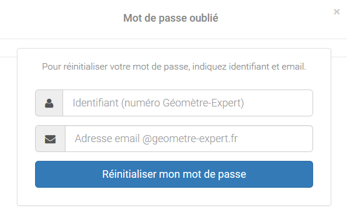

En cas de soucis, vous pouvez également solliciter l’assistance (``contact@geofoncier.fr``).

Gérer son profil utilisateur
----------------------------

Une fois la connexion au site établie, l’application vous identifie comme géomètre-expert. Votre structure d’exercice est automatiquement reconnue.

Pour modifier les informations de votre compte utilisateur, il vous suffit de cliquer sur le lien ``Mon profil`` situé dans le bandeau en haut à gauche du portail. Vous accédez alors à une fenêtre vous permettant de compléter/modifier les informations vous concernant:

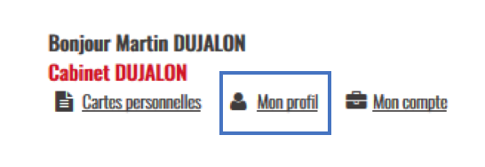

Vous disposez de la possibilité d’affecter un logo à votre compte utilisateur. Ce logo sera affiché lors de vos impressions. Il vous suffit pour ce faire de cliquer sur le bouton ``Parcourir`` et de spécifier le fichier à utiliser.

.. note:: peu importe les dimensions du logo, il sera redimensionné automatiquement lors de son utilisation. Cependant, le logo doit faire moins de 100 Ko car une taille supérieure ralentirait significativement le temps de chaque impression. 

Lorsqu’un logo a été importé, il apparaît automatiquement dans la fenêtre.

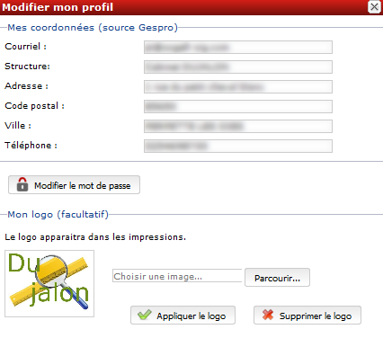

Le bouton ``Modifier le mot de passe`` ouvre une nouvelle fenêtre qui vous permet de spécifier un nouveau mot de passe:

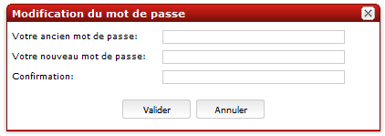

Vous devez alors saisir dans l’ordre: votre mot de passe actuel, un nouveau mot de passe et une confirmation de ce nouveau mot de passe (les deux derniers champs doivent contenir strictement la même chose pour pouvoir valider la fenêtre).

Gérer ses cartes personnelles
-----------------------------

Géofoncier vous permet de *mémoriser* des cartes personnelles. Pour accéder à l’outil de gestion de gestion de vos cartes, il suffit de cliquer sur le lien ``Cartes personnelles`` situé dans le bandeau enhaut à gauche du portail.

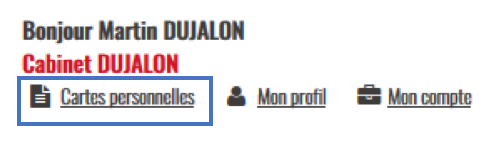

Une carte personnelle permet de mémoriser:

* La position du centre de la carte et l’échelle de la carte,

* Les couches actives,

* Les taux de transparence des couches et l’ordre des couches,

* Les annotations ajoutées à la carte,

* Les éventuelles couches WMS et /ou vectorielles rajoutéesmanuellement (cf. 4.1.7)

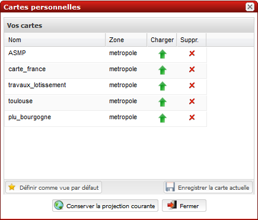

Sur chaque carte, le picto |charger| permet de charger une carte préalablement mémorisée et le picto |supprimer| permet de supprimer une carte.

Le bouton |sauver| permet de sauvegarde la configuration de la carte actuelle. Il vous est alors demandé de renseigner un nom pour la carte.

Le bouton |defaut| permet de retrouver la carte actuelle à chaque ouverture de session.

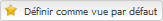

Le bouton |projection| permet de mémoriser le choix de la projection pour l’affichage des coordonnées.

Le bouton |fermer| permet de fermer la fenêtre

.. note:: Vous n’êtes pas limités en nombre de cartes personnelles mémorisables!

.. warning:: Il n’est pas possible de mémoriser les couches vecteur importées manuellement par l’outil ``lecteur KML / GPX`` (cf. 4.1.8).

Gestion du compte
-----------------

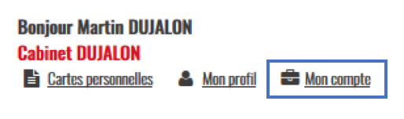

Affichage de la facture en ligne
^^^^^^^^^^^^^^^^^^^^^^^^^^^^^^^^

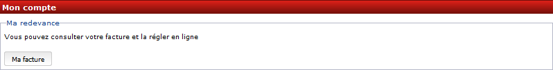

En cliquant sur ``Ma facture``, il est possible de connaître l’état de paiement de la facture, et de télécharger la facture de l’année en cours.

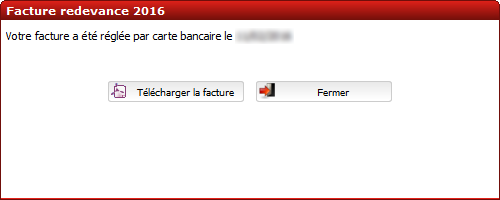

Gestion des comptes collaborateurs
^^^^^^^^^^^^^^^^^^^^^^^^^^^^^^^^^^

Depuis la version 16.06, il est possible (et même recommandé) de créer des comptes spécifiques pour les collaborateurs.

Les collaborateurs disposent de leurs identifiants et mots de passe propres. Il n'ont pas accès à la création, à la modification et à la suppression d’objets RFU, ni à la création, modification et suppression de dossiers (y compris l’import de pièces jointes).

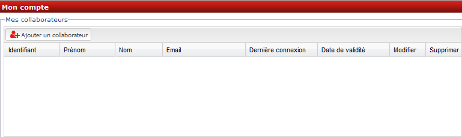

Un compte collaborateur équivaut à un compte géomètre-expert en mode **lecture seule**.

Pour rajouter un collaborateur, cliquer sur :

Un formulaire à renseigner s’affiche ensuite :

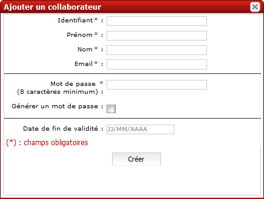

Il est toujours possible de modifier et de supprimer un compte
collaborateur.

Se déconnecter
--------------

Pour se déconnecter du portail Géofoncier, il suffit de cliquer sur le lien ``Déconnexion`` situé à droite du bandeau noir de la partie noire de la barre d’outils.

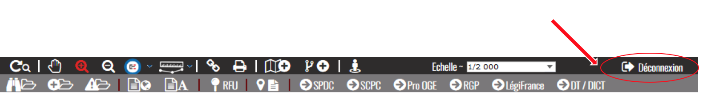

Afin de ne pas surcharger le serveur et pour des raisons de sécurité d'accès à votre compte, la déconnexion de Géofoncier est automatique au bout de 30 minutes d’inactivité.

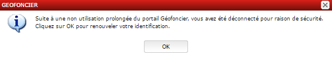

Lorsque la déconnexion est effective, vous êtes redirigé sur l’écran de connexion au portail Géofoncier.