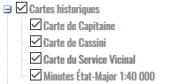
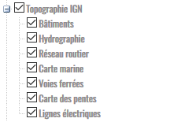

Couches de données disponibles
==============================

Le tableau qui suit répertorie les couches de données accessibles dans Géofoncier avec un compte «géomètre-expert».

Thème Géomètres-Experts
-----------------------

Ce thème donne accès aux données produites par l’ensemble des géomètres-experts.
La légende s’affiche en cliquant sur le nom de la couche (cf. `Affichage des couches de données <interface.html#gestion-de-l-affichage-des-couches-de-donnees>`_ )

+-------------------------------------------+-----------------------------------------------------+
|  * **Dossier**                            |   **Localisants des dossiers des géomètres-experts**|
|                                           |						 	  |
|  .. image:: _static/images/image692.png   |   Territoires : Tous				  |
|    :align: center                         |                 					  |
|                                           |   Activée par défaut : OUI			  |
|                                           |                                                     |
|                                           |   Interrogeable : OUI				  |
|                                           |                                                     |
|                                           |   Echelles d’affichage : à partir du 1/30 000       |
+-------------------------------------------+-----------------------------------------------------+
|  * **Documents Cadastraux (DMPC)**        |   **Localisants des documents cadastraux**       	  |
|				   	    |							  |
|  .. image:: _static/images/image842.png   |   Territoires : Tous               		  |
|    :align: center                         |                                                     |
|					    |						  	  |
|                                           |   Activée par défaut : OUI                          |
|                                           |          						  |
|                                           |   Interrogeable : OUI                               |
|                                           |                                                     |
|                                           |   Echelles d’affichage : à partir du 1/30 000       |
+-------------------------------------------+-----------------------------------------------------+
|  * **Croquis d'Arpentage (avant 1956)**   |   **Localisants des croquis d'arpentage**           |
|                                           |							  |
|  .. image:: _static/images/image843.png   |   Territoires : Tous                                |
|    :align: center                         |  							  |
|					    |							  |
|                                           |   Activée par défaut : NON    			  |
|                                           | 							  |
|                                           |   Interrogeable : NON				  |
|					    |							  |
|                                           |   Echelles d’affichage : à partir du 1/30 000       |
+-------------------------------------------+-----------------------------------------------------+
|  * **RFU**                                |   **Objets du Référentiel Foncier Unifié**          |
|                                           |							  |
|  .. image:: _static/images/image693.png   |   Territoires : Tous  				  |
|    :align: center                         |                                                     |
|                                           |   Activée par défaut : OUI                          |
|                                           |                                     		  |
|                                           |   Interrogeable : OUI (points)                      |
|                                           |                                               	  |
|                                           |   Echelles d’affichage : à partir du 1/30 000       |
|					    |							  |
+-------------------------------------------+-----------------------------------------------------+

+-------------------------------------------+-------------------------------------------------------------+
|  * **SIG OGE**                            |   Thème regroupant des couches de données produites         |
|                                           |                                                             |
|                                           |   et maintenues par l’Ordre des Géomètres-Experts.          |
|                                           |                                                             |
|                                           |   Le nombre et la teneur des couches proposées              |
|                                           |                                                             |
|                                           |   est susceptible de varier au cours du temps.              |
|                                           |                                                             |
+-------------------------------------------+-------------------------------------------------------------+
|  * **Bureaux des géomètres-experts**      |   **Localisants des cabinets de géomètres-experts**         |
|                                           |                                                             |
|  .. image:: _static/images/image696.png   |   Territoires : Tous                                        |
|    :align: center                         |                                                             |
|                                           |   Activée par défaut : NON                                  |
|                                           |                                                             |
|                                           |   Interrogeable : NON                                       | 
|                                           |                                                             |
|                                           |   Echelles d’affichage : jusqu’au 1/1 000                   |
+-------------------------------------------+-------------------------------------------------------------+
|  * **Années des AFR**                     |   **Zonage des aménagements fonciers ruraux par années**    |
|                                           |                                                             |
|  .. image:: _static/images/image697.png   |   Territoires : Métropole                                   |
|    :align: center                         |                                                             |
|                                           |   Activée par défaut : NON                                  |
|                                           |                                                             |
|                                           |   Interrogeable : NON                                       | 
|                                           |                                                             |
|                                           |   Echelles d’affichage : jusqu’au 1/1 000                   |
+-------------------------------------------+-------------------------------------------------------------+
|  * **Etat de la vectorisation cadastrale**|   **Zonage de l’état des documents cadastraux**             |
|                                           |                                                             |
|  .. image:: _static/images/image698.png   |   Territoires : Tous (sauf Saint-Martin et Saint-Barthélémy)|
|    :align: center                         |                                                             |
|                                           |   Activée par défaut : NON                                  |
|                                           |                                                             |
|                                           |   Interrogeable : NON                                       | 
|                                           |                                                             |
|                                           |   Echelles d’affichage : jusqu’au 1/60 000                  |
+-------------------------------------------+-------------------------------------------------------------+

Thème Géodésie
--------------

.. image:: _static/images/image699.png
	:align: right

Ce thème donne accès aux données du Service de Géodésie et Nivellement (SGN) de l’IGN.

La légende s’affiche en cliquant sur le nom de la couche (cf. `Affichage des couches de données <interface.html#gestion-de-l-affichage-des-couches-de-donnees>`_ ).

.. tip:: Pour accéder aux fiches des points géodésiques et des antennes du RGP, se reporter à la section `Interrogation de la couche Géodesie <outils.html#interro-geodesie-interrogation-de-la-couche-geodesie>`_.

Territoires : Tous

Activée par défaut : NON

Interrogeable : OUI (cf. `Affichage des couches de données <interface.html#gestion-de-l-affichage-des-couches-de-donnees>`_ )

+-------------------------------------------+-------------------------------------------+
|  .. image:: _static/images/image703.png   |   .. image:: _static/images/image701.png  |
|    :align: center                         |     :align: center                        |
|    :width: 300                            |     :width: 300                           |
+-------------------------------------------+-------------------------------------------+

Thème Environnement
-------------------

Ce thème donne accès à des couches WMS diffusées par le serveur CARMEN du MEEM (http://carto.ecologie.gouv.fr/)

La légende s’affiche en cliquant sur le nom de la couche mais également en cliquant sur l’icône |ico_info| qui apparaît lorsque le curseur de la souris est positionné sur le nom de la couche (cf. `Affichage des couches de données <interface.html#gestion-de-l-affichage-des-couches-de-donnees>`_ ).

Territoires : Tous

Activée par défaut : NON

Interrogeable : NON

Echelles d’affichage : du 1/1 000 au 1/1 000 000

.. image:: _static/images/image715.png
	:align: center
	:width: 400

+-------------------------------------------+-------------------------------------------+
|  .. image:: _static/images/image713.png   |   .. image:: _static/images/image717.png  |
|    :align: center                         |     :align: center                        |
|    :width: 300                            |     :width: 300                           |
+-------------------------------------------+-------------------------------------------+

Thème Risques
-------------

Ce thème donne accès à des couches WMS diffusées par le serveur Géorisque du MEEM (http://www.georisques.gouv.fr/).

La légende s’affiche en cliquant sur le nom de la couche (cf. `Affichage des couches de données <interface.html#gestion-de-l-affichage-des-couches-de-donnees>`_ ).

Territoires : Métropole

Activée par défaut : NON

Interrogeable : NON

Echelles d’affichage : du 1/30 000 au 1/250 000

Thème Urbanisme
---------------

Ce thème donne accès au plans de zonage des PLUi, PLU et Carte Communales diffusées sur le géoportail de l’urbanisme (https://www.geoportail-urbanisme.gouv.fr/).

La légende s’affiche en cliquant sur le nom de la couche (cf. `Affichage des couches de données <interface.html#gestion-de-l-affichage-des-couches-de-donnees>`_ ).

.. note:: Sur le géoportail de l’urbanisme, les données sont interrogeables et renvoient vers les pièces écrites des documents d’urbanisme.

Territoires : Tous (sauf Saint-Martin et Saint-Barthélémy)

Activée par défaut : NON

Interrogeable : NON

+-------------------------------------------+-------------------------------------------+
|  .. image:: _static/images/image726.png   |   .. image:: _static/images/image724.png  |
|    :align: center                         |     :align: center                        |
|    :width: 300                            |     :width: 300                           |
+-------------------------------------------+-------------------------------------------+
|  .. image:: _static/images/image721.png   |   .. image:: _static/images/image728.png  |
|    :align: center                         |     :align: center                        |
|    :width: 300                            |     :width: 300                           |
+-------------------------------------------+-------------------------------------------+

Thème Cartes historiques
------------------------

Ce thème donne accès à des cartes topographiques historiques.

La légende est accessible en cliquant sur l’icône |ico_info| qui apparaît lorsque le curseur de la souris est positionné sur le nom de la couche.

Territoires : Métropole

Activée par défaut : NON

Interrogeable : NON

Echelles d’affichage : du 1/120 000 au 1/8 000 000 (pour la carte de Capitaine), du 1/1 000 au 1/8 000 000 (pour la carte de Cassini), du 1/15 000 au 1/60 000 (pour la carte du Service Vicinal) et du 1/15 000 au 1/8 000 000 (pour les cartes minutes état-major).

.. note:: La couverture de la carte du Service Vicinal n'est pas complète sur l'ensemble de la France.

+-------------------------------------------+-------------------------------------------+
|  .. image:: _static/images/image734.png   |   .. image:: _static/images/image732.png  |
|    :align: center                         |     :align: center                        |
|    :width: 300                            |     :width: 300                           |
+-------------------------------------------+-------------------------------------------+

Thème Cartes géologiques
------------------------

.. image:: _static/images/image736.png
	:align: center

Ce thème donne accès aux cartes géologiques produites par le BRGM.

La légende est accessible en cliquant sur l’icône |ico_info| qui apparaît lorsque le curseur de la souris est positionné sur le nom de la couche.

Territoires : Métropole

Activée par défaut : NON

Interrogeable : NON

Echelles d’affichage : du 1/30 000 au 1/8 000 000 (pour le 50 000 scan) et du 1/15 000 au 1/500 000 (pour le 50 000 harmonisé).

+-------------------------------------------+-------------------------------------------+
|  .. image:: _static/images/image740.png   |   .. image:: _static/images/image738.png  |
|    :align: center                         |     :align: center                        |
|    :width: 300                            |     :width: 300                           |
+-------------------------------------------+-------------------------------------------+

Thème Topographie IGN
---------------------

Ce thème donne accès à des couches WMS correspondant à la BD TOPO de l’IGN.

La légende s’affiche en cliquant sur le nom de la couche (cf. `Affichage des couches de données <interface.html#gestion-de-l-affichage-des-couches-de-donnees>`_ ).

Pour la carte marine, la légende est accessible en cliquant sur l’icône |ico_info| qui apparaît lorsque le curseur de la souris est positionné sur le nom de la couche.

Territoires : Tous sauf Mayotte

Activée par défaut : NON

Interrogeable : NON

Echelles d’affichage : du 1/1 000 au 1/8 000 000 (sauf pour la carte marine, du 1/7 500 au 1/8 000 000)

+-------------------------------------------+-------------------------------------------+
|  .. image:: _static/images/image746.png   |   .. image:: _static/images/image744.png  |
|    :align: center                         |     :align: center                        |
|    :width: 300                            |     :width: 300                           |
+-------------------------------------------+-------------------------------------------+

Thème Registre Parcellaire Graphique
------------------------------------

.. image:: _static/images/image748.png
	:align: center

Ce thème donne accès au Registre parcellaire graphique (issu des déclarations PAC) pour les années 2007 à 2012.

La légende s’affiche en cliquant sur le nom de la couche (cf. `Affichage des couches de données <interface.html#gestion-de-l-affichage-des-couches-de-donnees>`_ ).

Territoires : Tous sauf Mayotte

Activée par défaut : NON

Interrogeable : NON

Echelles d’affichage : du 1/500 au 1/8 000 000 (pour les années 2010 à 2012) et du 1/7 500 au 1/8 000 000 (pour les années 2007 à 2009).

+-------------------------------------------+-------------------------------------------+
|  .. image:: _static/images/image752.png   |   .. image:: _static/images/image750.png  |
|    :align: center                         |     :align: center                        |
|    :width: 300                            |     :width: 300                           |
+-------------------------------------------+-------------------------------------------+

Thème Inventaire Forestier National
-----------------------------------

.. image:: _static/images/image754.png
	:align: center

Ce thème donne accès à l’Inventaire Forestier National produit par l’IGN

La légende s’affiche en cliquant sur le nom de la couche (cf. `Affichage des couches de données <interface.html#gestion-de-l-affichage-des-couches-de-donnees>`_ ).

Territoires : Métropole

Activée par défaut : NON

Interrogeable : NON

Echelles d’affichage : du 1/1 000 au 1/8 000 000

+-------------------------------------------+-------------------------------------------+
|  .. image:: _static/images/image758.png   |   .. image:: _static/images/image756.png  |
|    :align: center                         |     :align: center                        |
|    :width: 300                            |     :width: 300                           |
+-------------------------------------------+-------------------------------------------+

Thème Occupation du sol
-----------------------

.. image:: _static/images/image760.png
	:align: center

.. image:: _static/images/image764.png
	:align: left
	:width: 280

Ce thème donne accès à deux informations:

- le taux d’imperméabilisation des sols en 2006

- un état des lieux de l’occupation du sol réalisé par télédétection (programme européen Corine Land Cover) (visible du 1/2 000 000 au 1/60 000)

La légende s’affiche en cliquant sur le nom de la couche (cf. `Affichage des couches de données <interface.html#gestion-de-l-affichage-des-couches-de-donnees>`_ ).

Territoires : Métropole, Réunion, Guyane, Martinique, Guadeloupe

Activée par défaut : NON

Interrogeable : NON

Echelles d’affichage : du 1/60 000 au 1/2 000 000 (pour Corine Land Cover)

+-------------------------------------------+-------------------------------------------+
|  .. image:: _static/images/image762.png   |   .. image:: _static/images/image766.png  |
|    :align: center                         |     :align: center                        |
|    :width: 300                            |     :width: 300                           |
+-------------------------------------------+-------------------------------------------+

Thème Protection du patrimoine
------------------------------

.. image:: _static/images/image768.png
	:align: left

Ce thème donne accès à des couches de zonages issues l’Atlas des Patrimoines du Ministère de la Culture et de la communication (http://atlas.patrimoines.culture.fr/).

La légende s’affiche en cliquant sur le nom de la couche mais également en cliquant sur l’icône |ico_info| qui apparaît lorsque le curseur de la souris est positionné sur le nom de la couche (cf. `Affichage des couches de données <interface.html#gestion-de-l-affichage-des-couches-de-donnees>`_ ). 

.. note:: A la date de rédaction de ce document, des données sont diffusées pour seulement une partie des départements.

Territoires : Métropole et Réunion

Activée par défaut : NON

Interrogeable : NON

Echelles d’affichage : du 1/4 000 au 1/250 000

.. image:: _static/images/image770.png
	:align: center
	:width: 500

.. image:: _static/images/image772.png
	:align: center
	:width: 500

Thème Plans topographiques
--------------------------

.. image:: _static/images/image774.png
	:align: center

Ce thème donne accès à des plans topographiques.

.. note:: Les plans proposés en consultation proviennent des démarches Open Data des villes. A ce jour, seul le plan topographique de la ville de Paris est disponible.

Territoires : Métropole

Activée par défaut : NON

Interrogeable : NON

Echelles d’affichage : du 1/500 au 1/1 000

.. image:: _static/images/image776.png
	:align: center
	:width: 500

.. image:: _static/images/image778.png
	:align: center
	:width: 500

Thème PCI-Vecteur
-----------------

.. image:: _static/images/image780.png
	:align: center

Ce thème donne accès aux plans cadastraux PCI-Vecteur

.. warning:: A Saint-Martin et Saint-Barthélemy, le PCI-Vecteur est très mal géo-référencé.

La légende est accessible en cliquant sur l’icône |ico_info| qui apparaît lorsque le curseur de la souris est positionné sur le nom de la couche.

Territoires : Tous

Activée par défaut : NON

Interrogeable : NON

Echelles d’affichage : du 1/500 au 1/7 500

.. image:: _static/images/image784.png
	:align: center
	:width: 500

Thème Opendata
--------------

.. image:: _static/images/image786.png
	:align: right

Ce thème donne accès à deux données OpenData:

* le rendu Mapnik de la base de données OpenStreetMap

* des photographies aériennes faites par la société Mapbox

.. note:: OpenStreetMap est une base de données géographique libre fonctionnant sur le modèle de l’encyclopédie Wikipédia.

	Tout le monde peut y contribuer.

	Plus d’informations sur http://www.openstreetmap.org/

Territoires : Tous

Activée par défaut : NON

Interrogeable : NON

Fréquence de la mise à jourdu rendu Mapnik : toutes les 15 minutes

Echelles d’affichage : jusqu’au 1/2 000 (pour le rendu Mapnik) et
jusqu’au 1/1 000 (pour la photographie aérienne Mapbox)

+-------------------------------------------+-------------------------------------------+
|  .. image:: _static/images/image790.png   |   .. image:: _static/images/image788.png  |
|    :align: center                         |     :align: center                        |
|    :width: 300                            |     :width: 300                           |
+-------------------------------------------+-------------------------------------------+

Thème Géoportail IGN
--------------------

Ce thème donne accès aux données issues du Référentiel à Grande Échelle (RGE) de l’IGN.

.. image:: _static/images/image792.png
	:align: center

* **Limites administratives**

.. image:: _static/images/image794.png
	:align: left
	:width: 250

Limites administratives issues de la BD Carto. L’épaisseur et la couleur du trait varient en fonction du niveau administratif: région, département, arrondissement, canton et commune.

La légende s’affiche en cliquant sur le nom de la couche mais également en cliquant sur l’icône qui apparaît lorsque le curseur de la souris est positionné sur le nom de la couche (cf. `Affichage des couches de données <interface.html#gestion-de-l-affichage-des-couches-de-donnees>`_ ).

Territoires : Tous (sauf Mayotte et Guyane)

Activée par défaut : NON

Interrogeable : NON

Echelles d’affichage : jusqu’au 1/1 000

* **Cartes IGN**

.. image:: _static/images/image796.png
	:align: left
	:width: 250

Cartes produites par l’IGN comprenant notammentles cartes au 1/100 000 (TOP 100) et carte au 1/25 000 (série bleue). Le type de carte affiché est fonction de l’échelle.

La légende est accessible en cliquant sur l’icône qui apparaît lorsque le curseur de la souris est positionné sur le nom de la couche.

Territoires : Tous

Activée par défaut : OUI avec transparence

Interrogeable : NON

Echelles d’affichage : jusqu’au 1/2 000

* Photographies aériennes IGN

.. image:: _static/images/image798.png
	:align: left
	:width: 250

Photographies satellitaires ou BD Ortho de l’IGN suivant l’échelle d’affichage

Pour connaître le millésime de la BD Ortho sur un département, il suffit de cliquer sur l’icône qui apparaît lorsque le curseur de la souris est positionné sur le nom de la couche.

Territoires : Tous

Activée par défaut : OUI

Interrogeable : NON

Echelles d’affichage : jusqu’au 1/1 000

* **Photographies IGN 2006-2010**

.. image:: _static/images/image800.png
	:align: left
	:width: 200

Photographies BD Ortho de l’IGN années 2006-2010

Territoires : Métropole

Activée par défaut : NON

Interrogeable : NON

Echelles d’affichage : du 1/1 000 au 1/250 000

* **Photographies IGN 2000-2005**

.. image:: _static/images/image802.png
	:align: left
	:width: 200

Photographies BD Ortho de l’IGN années 2000-2005

Territoires : Métropole

Activée par défaut : NON

Interrogeable : NON

Echelles d’affichage : du 1/1 000 au 1/250 000

* **BD Parcellaire IGN**

.. image:: _static/images/image804.png
	:align: left
	:width: 250

Visualisation de la BD Parcellaire de l’IGN

Pour connaître le millésime de la BD Ortho sur votre département, vous pouvez cliquer sur l’icône qui apparaît lorsque le curseur de la souris est positionné sur le nom de la couche.

Territoires : Tous (sauf Mayotte et Guyane)

Activée par défaut : OUI avec transparence

Interrogeable : NON mais permet la localisation à la parcelle (cf. `Fonctions de localisation <interface.html#fonctions-de-localisation>`_)

Echelles d’affichage : à partir du 1/60 000 jusqu’au 1/1 000

Thème SIAGE
-----------

.. image:: _static/images/image807.png
	:align: center

Ce thème donne accès à des données produites par la société SIAGE.

Territoires : Guyane

Activée par défaut : NON

Interrogeable : NON

Echelles d’affichage : du 1/500 au 1/2 000 000 (pour l’Orthoguyane 30cm) et du 1/1 000 au 1/2 000 000 (pour les Orthoguyane 60 cm et 75cm)

.. image:: _static/images/image809.png
	:align: center
	:width: 500

Thème Littoral
--------------

.. image:: _static/images/image811.png
	:align: center

Ce thème donne accès à la zone des 50 pas géométriques.

Territoires : Réunion

Activée par défaut : NON

Interrogeable : NON

Echelles d’affichage : du 1/1 000 au 1/500 000

.. |ico_info| image:: _static/images/image167.png
