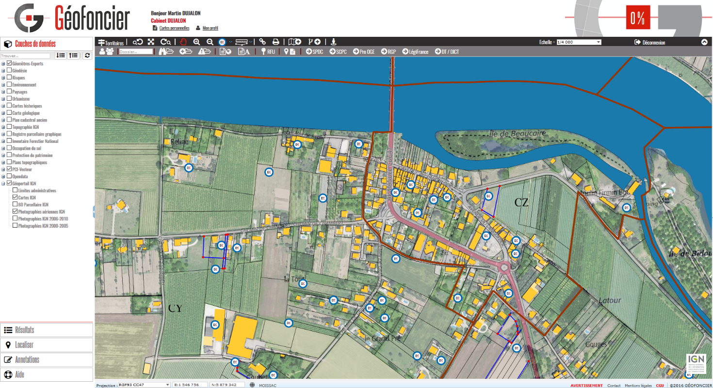

.. geofoncier documentation master file, created by
   sphinx-quickstart on Tue Nov 29 13:29:50 2016.
   You can adapt this file completely to your liking, but it should at least
   contain the root `toctree` directive.

Guide utilisateur
=================

**À destination des géomètres-experts et de leurs collaborateurs**

**Avant-propos**

Ce _document_ a été rédigé par la SAS Géofoncier pour servir de guide d’utilisation aux personnes appelées à manipuler le portail Géofoncier pour un usage professionnel au sein des structures d’exercice de la profession de géomètre-expert. Il constitue un document de référence régulièrement mis à jour au rythme des évolutions de Géofoncier.

Les utilisateurs sont expressément invités à rechercher dans ce document les réponses à leurs interrogations quant à la manipulation et au fonctionnement des différents modules et outils proposés par le portail Géofoncier. En cas de recherche infructueuse ou pour des questionnements d’autres natures, une assistance nationale dédiée aux utilisateurs du portail Géofoncier vous procurera les renseignements attendus.

Géofoncier poursuit l’objectif de répondre aux attentes des géomètres-experts et de leurs collaborateurs en leur procurant un outil moderne appelé à devenir le socle pérenne d’une infrastructure de données foncières tant désirée par la profession.

Bonne découverte du portail Géofoncier !

*L’équipe Géofoncier*

Les différentes sections de la documentation sont accessibles directement via le sommaire ci-dessous.

La documentation est également disponible au format PDF ici : http://readthedocs.org/projects/geofoncier/downloads/pdf/latest/

.. toctree::
   :maxdepth: 3

   introduction
   connexion
   interface
   outils
   commune
   donnees
   faq
   support
   annexes

