Présentation des différents éléments de l’interface
===================================================

L’interface du portail Géofoncier a été conçue pour permettre une utilisation aisée du portail. En fonction des droits de l’utilisateur connecté, les fonctionnalités et couches de données accessibles diffèrent. Toutes les descriptions qui suivent s’appliquent aux fonctionnalités et couches de données accessibles aux géomètres-experts.

Remarques générales sur l’utilisation de l’interface
----------------------------------------------------

Géofoncier est une application internet, ainsi l’ensemble du «programme» s’exécute dans une unique page web. Il n’est pas inutile de rappeler ici que l’utilisateur doit toujours garder à l’esprit que Géofoncier n’est pas un logiciel. L’application ne sera ainsi jamais aussi réactive qu’un logiciel de bureautique ou de DAO installé sur votre poste.

Les utilisateurs de Géofoncier doivent toujours veiller à respecter les consignes suivantes:

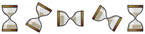

Attendre la fin de l’exécution d’une commande avant d’en lancer une autre. Si vous lancez plusieurs commandes à la suite sans laisser le temps à chaque commande de s’exécuter, vous risquez très vite de saturer l’application,

.. image:: _static/images/image104.png
   :alt: Pas de double clic
   :width: 200px
   :align: center

Ne jamais utiliser le double-clic sauf dans de très rares cas,

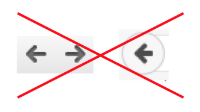

Ne jamais utiliser les boutons «suivant» et/ou «précédent» de votre navigateur. Toute l’application fonctionne dans une seule et même page web.

Comme toute application, Géofoncier n’est pas infaillible ! Dans l’hypothèse où l’application semble «bloquée», la meilleure solution consiste à cliquer sur le bouton ``Actualiser`` de votre navigateur.

.. note:: Le bouton «actualiser» se situe à proximité de la barre d’adresse de votre navigateur:

Modes d’affichage de l’interface
--------------------------------

Trois configurations sont possibles pour l’affichage du portail. Si vous souhaitez par exemple uniquement naviguer sur la carte, il vous est possible de masquer certaines parties de l’interface pour gagner en ergonomie.

La capture d’écran suivante présente l’état de l’interface lors d’une ouverture de session sur le territoire «France métropolitaine». Elle met en évidence les deux boutons qui permettent de masquer/afficher les bandeaux de l’interface.

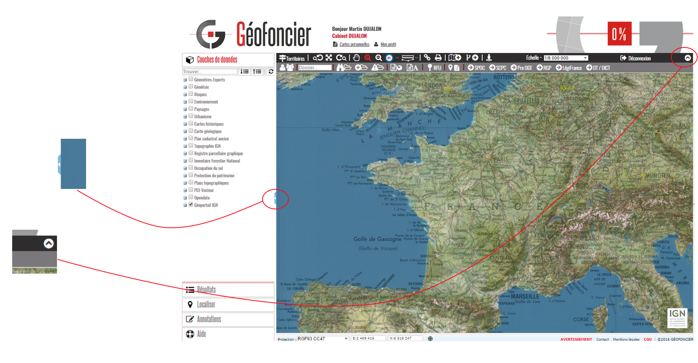

**Configuration 1** : bandeau gauche masqué

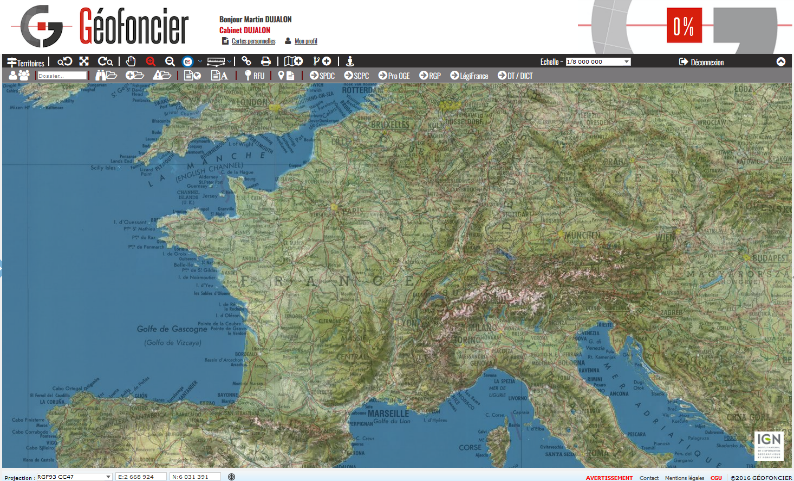

**Configuration 2** : bandeau haut masqué

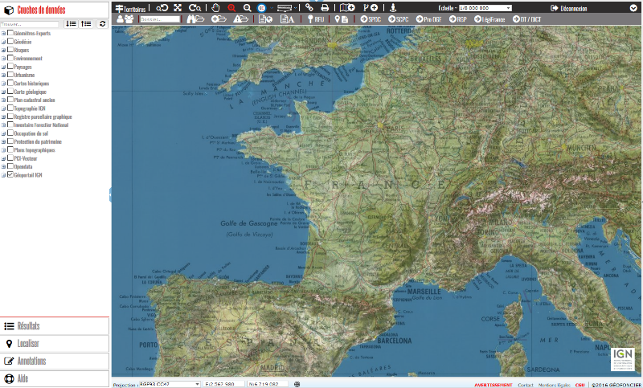

**Configuration 3** : bandeaux gauche et haut masqués

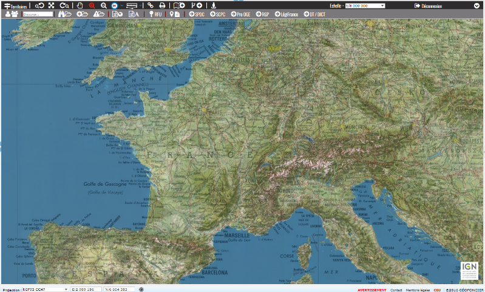

.. note:: Il est possible aussi d’activer le mode **plein écran** sur le navigateur pour bénéficier d’un espace de navigation maximal. Pour activer/désactiver le mode **plein écran** de votre navigateur, appuyer simplement sur la touche ``F11`` de votre clavier

Organisation de l’interface
---------------------------

La capture d’écran ci-après situe les différents éléments de l’interface.

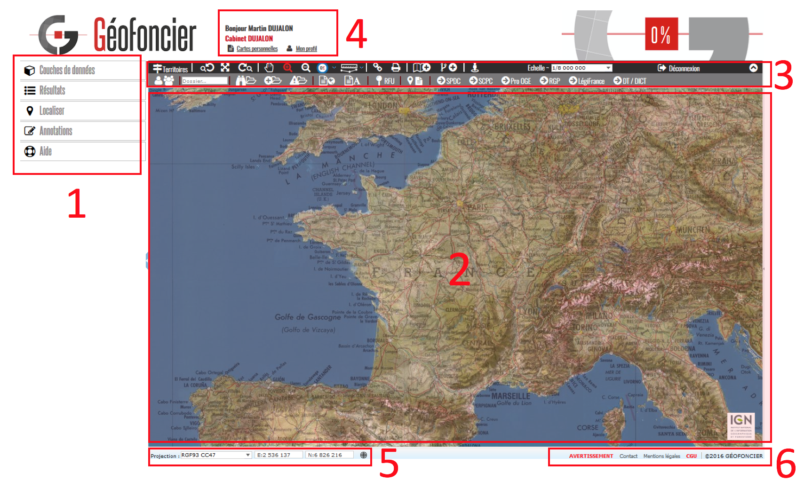

**ZONE 1** : Bandeau gauche comprenant cinq volets:

|couches| Gestion de l’affichage des différentes couches de données de la carte

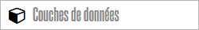

|resultats| Affichage des informations demandées par l’utilisateur

|localisation| Fonctionnalités de localisation sur la carte

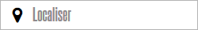

|annotations| Outils d’annotations de la carte

|aide| Aide contextuelle sur le fonctionnement de la fonction en cours d’exécution

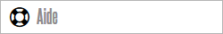

**ZONE 2** : Zone d’affichage de la carte

**ZONE 3** : Barres d’outils

**ZONE 4** : Information sur l’utilisateur connecté

**ZONE 5** : Gestion de l’affichage des coordonnées du curseur de la souris

**ZONE 6** : Liens vers les pages ``Avertissements``, ``Contact``, ``Mentions légales`` et ``CGU``

Gestion de l'affichage des couches de données
^^^^^^^^^^^^^^^^^^^^^^^^^^^^^^^^^^^^^^^^^^^^^

Le volet ``Couches de données`` vous permet d’agir sur les paramètres d’affichage des différentes couches de données. Il vous est ainsi possible d’obtenir la carte qui correspond le mieux à vos attentes.

L’ensemble des couches de données sont classées par thèmes et éventuellement sous-thèmes. Au regard de chaque thème / sous-thème se trouve une icône vous permettant de développer (|developper| ) ou de réduire (|reduire|) la liste des couches disponibles.

Pour chaque couche de données, il est possible d’agir sur différents paramètres d’affichage:

**Visibilité de la couche de données**

Il suffit de cliquer sur la case à cocher située à gauche du nom de la
couche.

|couche_affichee| >> La couche est affichée

|couche_pas_affichee| >> La couche n’est pas affichée

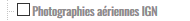

Lorsqu’une couche de données est active et que la position de la carte
change, le libellé de la couche de données change de forme pour vous
signaler son état:

|couche_chargee| >> La couche est chargée

|couche_en_cours| >> La couche est en cours de chargement (italique)

.. |couche_en_cours| image:: _static/images/image154.png
   :align: middle
   :width: 150

|couche_pas_visible| >> La couche n’est pas affichable à l’échelle demandée (case à cocher grisée)

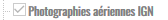

**Modification de la transparence de la couche de données**

Lorsque vous cliquez sur le nom d’une couche, un curseur apparait pour vous permettre d’agir sur le taux de transparence de la couche de 0% (translucide) à 100% (opaque). Un second clic sur le nom de la couche vous permet de masquer le curseur. En bougeant le curseur, le taux de transparence s’affiche.

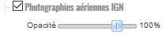

**Modification de l’ordre d’affichage de la couche de données**

La superposition des couches de données s’effectue de bas en haut. Pour changer la position d’une couche de données dans l’arbre des couches, il suffit d’effectuer un glisser-déposer pour placer une couche au-dessus ou au-dessous d’une autre.

Lorsque vous tentez de faire un glisser-déposer d’une couche de données, une info bulle apparait à côté du curseur de la souris. La case à cocher qu’elle contient vous rappelle si la couche de données est active ou non:

|teria_1| >> Impossible de placer la couche ici : si vous relâchez, rien ne se passe

|teria_2| >> La couche sera déplacée dans ce thème/sous-thème : vous pouvez relâcher.

|teria_3| >> La couche change de position : vous pouvez relâcher.

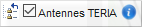

.. note:: Un glisser-déposer consiste à cliquer sur le nom d’une couche de données et, tout en restant cliqué, à changer la position de l’élément dans l’arbre des couches.

**Légende de la couche de données**

Pour afficher la légende d’une couche de données, il suffit de cliquer sur le nom de la couche pour développer le contenu de la légende. Sur certaines couches, la légende est accessible en cliquant sur l’icône |i| qui apparaît lorsque le curseur de la souris est positionné sur le nom de la couche.

**Informations liées à la couche**

Sur certaines couches, des informations complémentaires sont accessibles en cliquant sur l’icône |i| qui apparaît lorsque le curseur de la souris est positionné sur le nom de la couche.

**Rechercher une couche de données**

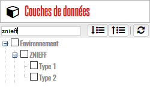

Pour gagner en efficacité, Géofoncier vous propose un outil vous permettant de filtrer l’arbre des couches. Dès lors, il suffit de saisir les premières lettres du nom d’une couche pour la retrouver facilement. Pour retrouver la liste complète des couches, il suffit d’effacer le texte saisi.

**Développer / Réduire / Réinitialiser l’arbre des couches**

Trois boutons vous permettent d’agir à tout instant sur l’arbre des
couches:

|btn_dev| >> Permet de développer l’arbre des couches

|btn_red| >> Permet de réduire l’arbre des couches

|btn_init| >> Réinitialise l’arbre des couches

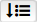

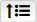

.. note:: La réinitialisation de l’arbre des couches a pour effet de désactiver toutes les couches précédemment sélectionnées par l’utilisateur, hormis la couche «Cartes IGN» (opacité 40 %), la couche «Photographies aériennes IGN», la couche plan cadastral SPDC et les couches géomètres-experts RFU et dossiers. De même, l’ordre d’affichage des couches de données se réinitialise par rapport au schéma initial.

Affichage des résultats d’une commande
^^^^^^^^^^^^^^^^^^^^^^^^^^^^^^^^^^^^^^

Le volet ``Résultats`` est la zone d’affichage des résultats produits par une commande, notamment l’interrogation des couches de données et l’affichage des informations communales.

Fonctions de localisation
^^^^^^^^^^^^^^^^^^^^^^^^^

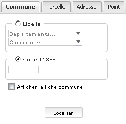

Le volet ``Localiser`` vous permet de positionner la carte à un endroit précis. Il est possible de se localiser sur une commune, sur une section ou parcelle cadastrale, sur une adresse ou un toponyme, ou un point.

Les données exploitées pour permettre la localisation sont les contours communaux et les localisants de la BD Parcellaire (IGN).

.. attention:: Certains territoires ne proposent pas tous les types de localisation:

	* pas de localisation à la commune sur Saint-Martin et Saint-Barthélemy (commune unique)

	* pas de localisation à la parcelle cadastrale à Mayotte (absence de BD Parcellaire)

**Onglet «Commune»**

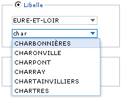

L’onglet ``Commune`` permet de centrer la carte sur l’ensemble d’une commune. Vous disposez de deux possibilités pour sélectionner une commune:

* Choix d’un département puis d’une commune (les listes se filtrent automatiquement suivant la saisie / possibilité de choisir un département en saisissant son numéro)

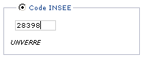

OU

* Indication d’un code INSEE: si le code INSEE existe, la commune correspondante s’affiche.

La case à cocher ``Afficher la fiche commune`` permet, en plus de la localisation, d’accéder aux informations communales (cf. `Informations communales <commune.html>`_).

Un clic sur le bouton ``Localiser`` adapte alors la position et l’échelle de la carte de façon à pouvoir visualiser l’ensemble du territoire communal.

**Onglet «Adresse»**

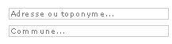

L’onglet ``Adresse`` permet une localisation à l’adresse ou sur un toponyme. Il suffit de renseigner les deux champs «adresse ou toponyme» et «commune». Le mode de fonctionnement de la fonction est le suivant:

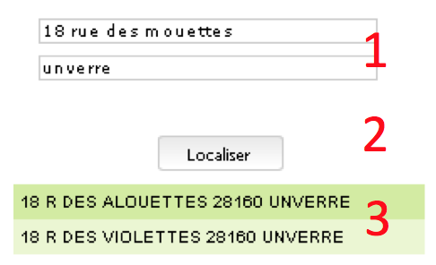

1. Renseignement des deux champs

2. Clic sur le bouton «localiser»: cela a pour effet d’afficher les résultats les plus probables

3. Clic sur une des lignes résultat: la carte est alors centrée

**Onglet «Parcelle»**

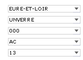

L’onglet ``Parcelle`` permet une localisation à la parcelle cadastrale. Il suffit de renseigner les différents champs de façon descendante:

``Département`` >> ``Commune`` >> ``Préfixe`` >> ``Section`` >> ``Parcelle``

Seuls les préfixes, sections, et numéros existants sur la commune sont proposés. Pour la sélection du département, il est possible de saisir son numéro.

.. image:: _static/images/image186.png
   :align: right
   :width: 120

Un clic sur le bouton ``Localiser`` centre la carte sur la parcelle spécifiée et force l’échelle au 1/2000. L’affichage de la section et du numéro de parcelle sur la carte permet d’obtenir la confirmation que l’on se situe bien sur la parcelle recherchée.

.. note:: Le premier préfixe de la commune est toujours sélectionné par défaut. ``000`` signifie qu’il n’y a pas de préfixe sur la commune. C’est le cas la plupart du temps.

.. tip:: Pour localiser une section cadastrale, il suffit de ne rien spécifier dans le champ «parcelle» et de cliquer directement sur le bouton ``Localiser``. Géofoncier se centre alors sur l’emprise de la section et affiche en rouge sa référence au centre.

.. note:: Pour les communes de Paris et Lyon, le préfixe correspond au code de l’arrondissement municipal.

**Onglet «Point»**

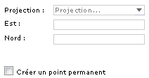

L’onglet ``Point`` permet de se localiser sur les coordonnées d’un point exprimé dans un des systèmes de coordonnées légaux du territoire.

La case à cocher ``Créer un point permanent``, permet de garder une trace du point sur lequel la localisation a été effectuée.

Outils d’annotations
^^^^^^^^^^^^^^^^^^^^

Le volet ``Annotation`` vous permet de «dessiner» des objets sur la carte. Cela peut être utile pour concevoir, par exemple, des plans de situation.

Plusieurs types d’éléments peuvent être ajoutés :

|symbole|  **Des symboles**

|polyligne|  **Des (poly)lignes**

|libre|  **Des lignes à main levée**

|polygone|  **Des polygones**

|cercle|  **Des cercles**

|texte|  **Du texte**

**Paramètre définissables pour chaque type d’éléments**

- **Symbole :**

+--------------------------------------+
|.. image:: _static/images/image203.png|
+--------------------------------------+

*Ce paramètre est spécifique au type d’éléments symbole.*

Pour changer de type de symbole, il suffit de cliquer sur le symbole ``cercle``.

Un choix de symbole s’affiche. Il suffit alors de cliquer sur le symbole souhaité.

D’autres symboles peuvent être importés en cliquant sur ``plus de symboles``.

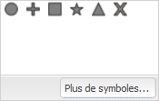

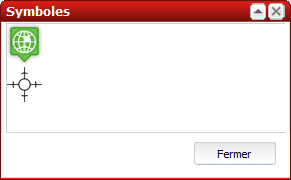

- **Couleur :**

+--------------------------------------+
|.. image:: _static/images/image209.png|
+--------------------------------------+

*Ce paramètre est commun à tout type d’éléments.*

Pour changer de couleur, il suffit de cliquer sur la couleur orange par défaut (couleur noire par défaut pour le type d’élément texte)

Un choix de couleur s’affiche. Il suffit alors de cliquer sur la couleur souhaitée.

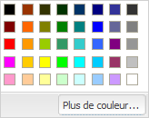

Une palette de couleur plus large est disponible en cliquant sur ``plus de couleurs``.

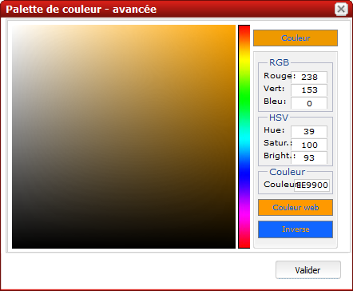

Il est possible de définir une couleur par ses composantes RGB, HSV ou son codage hexadécimal

.. note:: Pour plus d’informations à ce sujet : https://fr.wikipedia.org/wiki/Couleur_du_Web

- **Taille :**

+--------------------------------------+
|.. image:: _static/images/image214.png|
+--------------------------------------+

*Ce paramètre est commun aux types d’éléments symbole et texte.*

*Pour les symboles, la taille s’exprime en pixels, et pour le texte, la taille s’exprime en points.*

Pour changer de taille, il suffit de cliquer sur les flèches du champ taille, ou de rentrer directement la taille souhaitée dans le champ correspondant.

- **Largeur :**

+--------------------------------------+
|.. image:: _static/images/image216.png|
+--------------------------------------+

*Ce paramètre est commun aux types d’éléments (poly)ligne, ligne à main levée, polygone et cercle.*

La largeur s’exprime en pixels.

Pour changer de largeur, il suffit de cliquer sur les flèches du champ largeur, ou de rentrer directement la largeur souhaitée dans le champ correspondant.

- **Opacité :**

+--------------------------------------+
|.. image:: _static/images/image218.png|
+--------------------------------------+

*Ce paramètre est commun à tout type d’éléments, sauf texte.*

Pour changer l’opacité, il suffit de cliquer sur le curseur pour le bouger sur la règle. Lorsque le curseur est sélectionné par le clic gauche, le taux d’opacité s’affiche.

- **Label :**

+--------------------------------------+
|.. image:: _static/images/image220.png|
+--------------------------------------+

*Ce paramètre est spécifique au type d’éléments texte.*

Pour changer le label, il suffit de cliquer dans le champ et de remplacer par le texte souhaité.

.. note:: Les caractères ``{i}`` permettent d’afficher un numéro incrémental. 
	(exemple: lot 1, lot 2, lot 3 )

- **Police :**

+--------------------------------------+
|.. image:: _static/images/image222.png|
+--------------------------------------+

*Ce paramètre est spécifique au type d’éléments texte.*

Pour changer la police, il suffit de cliquer sur la flèche à droite du champ.

4 polices sont disponibles: Arial, Verdana, Times, Tahoma

- **Style :**

+--------------------------------------+
|.. image:: _static/images/image224.png|
+--------------------------------------+

*Ce paramètre est spécifique au type d’éléments texte.*

|gras| En cliquant sur ce bouton, le texte devient gras.

|italique| En cliquant sur ce bouton, le texte devient italique.

Il suffit de cliquer à nouveau sur les boutons pour désactiver le style.

.. note:: Par défaut, l’option «gras» est activée.

**Procédure pour chaque type d’éléments**

+---------------------------------------------------------------------+------------------------------------------------+
| Bouton                                                              | Ecran                                          |
+=====================================================================+================================================+
| |symbole| **Dessiner un symbole :**                                 | .. image:: _static/images/image232.png         |
|                                                                     |                                                |
| 1. Renseigner les paramètres du symbole                             |                                                |
|                                                                     |                                                |
| 2. Cliquer la position du point sur la carte                        |                                                |
|                                                                     |                                                |
+---------------------------------------------------------------------+------------------------------------------------+
| |polyligne| **Dessiner une (poly)ligne :**                          | .. image:: _static/images/image235.png         |
|                                                                     |                                                |
| 1. Renseigner les paramètres de la (poly)ligne                      |                                                |
|                                                                     |                                                |
| 2. Cliquer les différents points de la (poly)ligne                  |                                                |
|                                                                     |                                                |
| 3. Double-cliquer pour terminer la (poly)ligne                      |                                                |
|                                                                     |                                                |
+---------------------------------------------------------------------+------------------------------------------------+
| |libre| **Dessiner une ligne à main levée :**                       | .. image:: _static/images/image235.png         |
|                                                                     |                                                |
| 1. Renseigner les paramètres de la ligne                            |                                                |
|                                                                     |                                                |
| 2. Dessiner la ligne sur la carte en restant cliqué pour dessiner   |                                                |
|                                                                     |                                                |
+---------------------------------------------------------------------+------------------------------------------------+
| |polygone| **Dessiner un polygone :**                               | .. image:: _static/images/image240.png         |
|                                                                     |                                                |
| 1. Renseigner les paramètres du contour et du fond                  |                                                |
|                                                                     |                                                |
| 2. Dessiner la ligne sur la carte en restant cliqué pour dessiner   |                                                |
|                                                                     |                                                |
+---------------------------------------------------------------------+------------------------------------------------+
| |cercle| **Dessiner un cercle :**                                   | .. image:: _static/images/image240.png         |
|                                                                     |                                                |
| 1. Renseigner les paramètres du cercle                              |                                                |
|                                                                     |                                                |
| 2. Dessiner la ligne sur la carte en restant cliqué pour dessiner   |                                                |
|                                                                     |                                                |
+---------------------------------------------------------------------+------------------------------------------------+
| |texte| **Ajouter un texte :**                                      | .. image:: _static/images/image244.png         |
|                                                                     |                                                |
| 1. Renseigner les paramètres du texte                               |                                                |
|                                                                     |                                                |
| 2. Cliquer le point d’insertion du texte sur la carte               |                                                |
|                                                                     |                                                |
+---------------------------------------------------------------------+------------------------------------------------+
| |editer| **Editer un objet :**                                      | .. image:: _static/images/image257.png         |
|                                                                     |                                                |
|   Cliquer sur l’objet à éditer.         			      |                                                |
|                                                                     |                                                |
| |p1| Poignée permettant de déplacer l’objet                         |                                                |
|                                                                     |                                                |
| |p2| Poignée permettant de tourner l’objet                          |                                                |
|                                                                     |                                                |
| |p3| Poignée permettant d’étirer l’objet                            |                                                |
|                                                                     |                                                |
| |p4| Poignée permettant de modifier le point                        |                                                |
|                                                                     |                                                |
| |p5| Poignée permettant de rajouter un point                        |                                                |
|                                                                     |                                                |
|                                                                     |                                                |
+---------------------------------------------------------------------+------------------------------------------------+

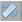

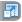

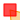

.. tip:: Pour supprimer un point : placer le curseur de la souris sur la poignée |p4| puis appuyer sur la touche «suppr» du clavier.

.. tip:: En fonction du type d'objet, il est possible de modifier sa forme, son orientation, sa position et sa taille.

|suppr_objet| **Supprimer les objets visibles ou l’objet sélectionné**

Si un objet est sélectionné (au moyen de l’outil ``éditer un objet``), seul celui-ci sera effacé.

Sinon, tous les objets visibles à l’écran sont effacés.

|suppr_objets| **Supprimer tous les objets ou l’objet sélectionné**

Si un objet est sélectionné (au moyen de l’outil ``éditer un objet``), seul celui-ci sera effacé.

Sinon, tous les objets sont effacés.

**Export des annotations**

L’ensemble des annotations apportés sur le portail sont exportables dans plusieurs formats.

Il suffit pour cela de cliquer sur le bouton correspondant en bas de la fenêtre des options d’annotations.

|kml| Export au format kml (compatible avec le logiciel Google Earth),

|gpx| Export au format gpx (compatible avec les GPS de randonnée grand public)

|dxf| Export au format dxf (compatible avec les logiciels DAO)

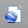

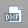

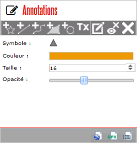

Affichage de l’aide contextuelle
^^^^^^^^^^^^^^^^^^^^^^^^^^^^^^^^

Le volet «Aide» propose des liens vers des documents PDF (le présent guide utilisateur et la documentation technique sur l’API Géofoncier), ainsi qu’un lien «Production du RFU» vers des vidéos tutoriels pour la production topologique des objets RFU.

Affichage des coordonnées du curseur de la souris
^^^^^^^^^^^^^^^^^^^^^^^^^^^^^^^^^^^^^^^^^^^^^^^^^

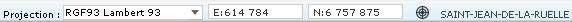

Géofoncier vous permet d’obtenir à tout moment les coordonnées du curseur de votre souris en coordonnées planes (arrondies au mètre) ou géographiques (degrés sexagésimaux arrondis au dixième de seconde).

Les coordonnées s’actualisent au moindre mouvement du curseur sur la carte.

.. note:: Les coordonnées ainsi obtenues sont indicatives. Elles résultent d’interpolations mathématiques.

Le choix proposé pour les projections est fonction du territoire considéré. Dans tous les cas, il s’agit des systèmes légaux en vigueur.

+-----------------------------------+------------------------------------------------+
| Territoire                        | Projection                                     |
+===================================+================================================+
| France métropolitaine             | RGF93: Lambert 93                              |
|                                   +------------------------------------------------+
|                                   | RGF93: CC42                                    |
|                                   +------------------------------------------------+
|                                   | RGF93: CC43                                    |
|                                   +------------------------------------------------+
|                                   | RGF93: CC44                                    |
|                                   +------------------------------------------------+
|                                   | RGF93: CC45                                    |
|                                   +------------------------------------------------+
|                                   | RGF93: CC46                                    |
|                                   +------------------------------------------------+
|                                   | RGF93: CC47                                    |
|                                   +------------------------------------------------+
|                                   | RGF93: CC48                                    |
|                                   +------------------------------------------------+
|                                   | RGF93: CC49                                    |
|                                   +------------------------------------------------+
|                                   | RGF93: CC50                                    |
|                                   +------------------------------------------------+
|                                   | WGS84: coordonnées géographiques               |
+-----------------------------------+------------------------------------------------+
| Guyane                            | RGFG95: UTM Nord fuseau 22                     |
|                                   +------------------------------------------------+
|                                   | RGFG95: UTM Nord fuseau 21                     |
|                                   +------------------------------------------------+
|                                   | WGS84: coordonnées géographiques               |
+-----------------------------------+------------------------------------------------+
| Guadeloupe                        | RRAF: UTM Nord fuseau 20                       |
|                                   |                                                |
| Martinique                        |                                                |
|                                   +------------------------------------------------+
| Saint-Martin                      | WGS84: coordonnées géographiques               |
|                                   |                                                |
| Saint-Barthélemy                  |                                                |
|                                   |                                                |
+-----------------------------------+------------------------------------------------+
| Réunion                           | RGR92: UTM Sud fuseau 40                       |
|                                   +------------------------------------------------+
|                                   | WGS84: coordonnées géographiques               |
+-----------------------------------+------------------------------------------------+
| Mayotte                           | RGM04: UTM Sud fuseau 38                       |
|                                   +------------------------------------------------+
|                                   | WGS84: coordonnées géographiques               |
+-----------------------------------+------------------------------------------------+

Pour obtenir les coordonnées d’un point précis de la carte, cliquer sur |coord_point| puis cliquer sur le point. Une fenêtre avec les coordonnées du point apparait alors.

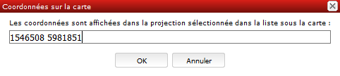

Affichage du nom de la commune
^^^^^^^^^^^^^^^^^^^^^^^^^^^^^^

Pour les échelles supérieures ou égales au 1/7 500, il est possible de connaitre la commune sur laquelle se situe le centre de la carte.

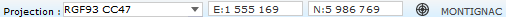

.. tip:: Un simple clic sur le nom de la commune permet d’accéder facilement à la fenêtre «fiche commune» (cf. `Informations communales <commune.html>`_).

Choix de l‘échelle d’affichage de la carte
^^^^^^^^^^^^^^^^^^^^^^^^^^^^^^^^^^^^^^^^^^

Géofoncier propose 15 échelles prédéfinies pour l’affichage des données. Elles s’échelonnent du 1/8 000 000 au 1/500.

Il est possible de visualiser les données aux échelles suivantes:

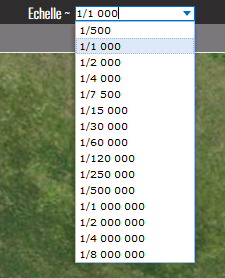

L’affichage de l’échelle de la carte est dynamique. À chaque changement d’échelle provoqué par l’application, l’élément sélectionné dans la liste se met à jour.

.. note:: Au moment de l’ouverture d’une session, l’échelle 1/8 000000 est sélectionné par défaut. Cela ne concerne pas le cas où l’utilisateur a défini une vue par défaut. (cf. `Gérer ses cartes personnelles <connexion.html#gerer-ses-cartes-personnelles>`_)

.. note:: Les plages d’échelles disponibles peuvent varier en fonction du territoire considéré.

.. attention::  Les échelles proposées dans la liste ne sont pas rigoureuses. Il s’agit d’échelles arrondies dont la valeur exacte est directement liée à la résolution des images fournies par l’API de l’IGN.

Avertissements, contact, mentions légales et CGU
^^^^^^^^^^^^^^^^^^^^^^^^^^^^^^^^^^^^^^^^^^^^^^^^

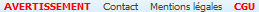

Trois liens situés en bas à droite de l’interface permettent d’accéder à trois écrans présentant:

* ``Avertissement`` >> Avertissements généraux sur l’utilisation du portail

* ``Contact`` >> Coordonnées de la hotline

* ``Mentions légales`` >> Mentions légales

* ``CGU`` >> Conditions générales d’utilisation du portail
