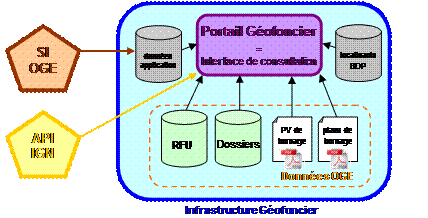
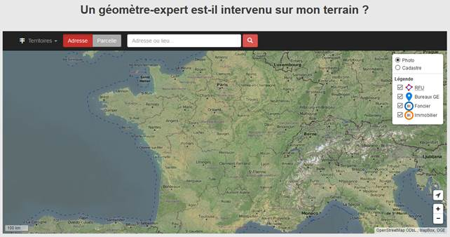

1. Présentation du portail Géofoncier
=====================================

Le portail Géofoncier a été lancé au 40 ème Congrès de l’Ordre desGéomètres-Experts le 23 juin 2010 à Marseille. Son ouverture auxgéomètres-experts date du 1er juillet 2010. Il s’agit de la première Infrastructure nationale de Données Spatiales (IDS) mise en place par une profession libérale en France.

1.1 Qu’est-ce que Géofoncier ?
------------------------------

Géofoncier est une application extranet de type portail cartographique orientée web 2.0. Le terme «Géofoncier» fait référence à la fois à l’interface de consultation (site internet) et à l’ensemble des bases de données sous-jacentes nécessaires à son fonctionnement, notamment les bases Dossiers, Référentiel Foncier Unifié (RFU) et Document Cadastraux Anciens.

L’ensemble de la plateforme informatique est gérée et maintenue par la société Géofoncier SAS.

1.1.1 Principe de fonctionnement
^^^^^^^^^^^^^^^^^^^^^^^^^^^^^^^^

Le portail Géofoncier permet d’accéder à plusieurs entrepôts de données géographiques par la mise en œuvre de diverses technologies interopérables d’accès aux données:

· Appels de flux issus de l’API Géoportail (IGN) pour l’affichage de certaines couches du Référentiel à Grande Échelle (RGE) produit et maintenu par l’Institut Géographique National (IGN),

· Appels de flux normalisés OGC pour l’affichage de couches de données maintenues par les partenaires (par exemple le PCI-Vecteur issu de cadastre.gouv.fr, la position des points géodésiques fournis par le Service Géodésie et Nivellement (SGN) de l’IGN),

· Accès directs aux données dont l’OGE est le détenteur et le gestionnaire: localisants des dossiers, RFU et Document Cadastraux Anciens.

*Schéma de principe de l’infrastructure Géofoncier*

L’objectif poursuivi par ces différents modes d’accès aux données est de disposer de données constamment à jour, tout en réduisant au minimum les travaux de maintenance et d’intégration des données nouvelles. La plupart des données accessibles dans le portail Géofoncier sont ainsi maintenues par les différents partenaires de façon totalement transparente pour l’utilisateur.

1.1.2 Un portail novateur
^^^^^^^^^^^^^^^^^^^^^^^^^^

A son ouverture en juillet 2010, Géofoncier est le seul portail cartographique en ligne à proposer une localisation à la parcelle cadastrale sur l’ensemble du territoire français et à offrir, dans le même temps, la possibilité de croiser différentes couches de données géoréférencées.

Géofoncier fonctionne sur tous les territoires où l’OGE est présent:

· France métropolitaine: France continentale et Corse

· Guyane (statut de DOM)

· Réunion (statut de DOM)

· Mayotte (statut de DOM)

· Guadeloupe (statut de DOM)

· Martinique (statut de DOM)

· Saint-Martin (statut de COM depuis 2007)

· Saint-Barthélemy (statut de COM depuis 2007)

Géofoncier est par ailleurs l’un des premiers portails nationaux à s’appuyer sur l’API Géoportail lancée par l’IGN en juin 2008 pour un accès facilité à certaines couches du RGE.

1.2 Genèse du projet Géofoncier
--------------------------------

L’acte de naissance de Géofoncier est le 6 éme point de la charte d’engagement des géomètres-experts en faveur du développement et de l’aménagement durable[1] signée entre l’OGE et son ministère de tutelle, le MEEDDAT, le 17 septembre 2008 au cours du 39 ème congrès national de la profession.

Initialement connu sous le vocable «e-Foncier», un prototype du portail Géofoncier a été testé sur la période 2007-2010 en région Midi-Pyrénées. Cette phase de prototypage a permis d’identifier les attentes des utilisateurs en termes de fonctionnalités et d’accès aux couches de données. Il a également permis de tester la montée en puissance progressive de l’application par le passage d’un niveau départemental à un niveau régional.

Le prototype e-Foncier a notamment permis de tester l’intérêt que pourrait susciter un portail tel que Géofoncier auprès de l’ensemble des partenaires de la profession: collectivités territoriales, notaires, services du cadastre, agents immobiliers

Le retour d’expérience du prototype e-Foncier a permis à l’OGE de rédiger un cahier des charges début 2010. La société Géosignal et le Bureau de Recherches Géologiques et Minières (BRGM)[2] ont respectivement été retenus pour le développement de l’interface et l’hébergement de la plateforme informatique. En 2011, la société NEOGEO TECHNOLOGIES[3] a été retenue en remplacement de Géosignal pour la maintenance applicative de la plateforme Géofoncier. Depuis 2011, la société SOGEFI[4] assure les missions d’administration technique du portail ainsi que l’assistance aux utilisateurs.

1.3 Accès au portail Géofoncier
--------------------------------

Il est nécessaire de s’identifier pour accéder au portail Géofoncier.

Néanmoins, sur la page d’accueil, une carte interactive dite «viewer INSPIRE» à destination du grand public permet la visualisation d’un certain nombre de données sans connexion préalable. Cette carte est visible depuis la page d’accueil du site Géofoncier[5].

*« Viewer INSPIRE » accessible sur la page d’accueil du site Géofoncier*

1.4 Les partenaires du portail Géofoncier
------------------------------------------

La mise en place du portail Géofoncier s’appuie sur des partenariats conclus avec différentes institutions proches de la profession:

· Association Française pour l’Information GÉOgraphique (AFIGÉO) avec qui une convention de partenariat a été signée en décembre 2008 pour étudier la faisabilité du portail Géofoncier.

· Institut National de l’Information Géographique et Forestière (IGN) avec qui une convention de partenariat a été signée le 23 juin 2010 pour notamment permettre l’accès aux données du RGE via les flux de l’API Géoportail.

· Direction Générale des Finances Publiques (DGFiP): signature d’une convention le 24 juin 2010 pour notamment obtenir l’accès aux PCI-Vecteur pour lesquels l’OGE est partenaire des conventions de numérisation directement dans Géofoncier.

· Association des Maires de France (AMF): signature d’une charte de partenariat le 31 janvier 2012 pour promouvoir notamment l’accès aux documents d’urbanisme dans Géofoncier

Le portail Géofoncier est interconnecté avec d’autres portails nationaux tels que cadastre.gouv.fr ou le Géoportail de l 'Urbanisme.

1.5 La SAS Géofoncier
----------------------

Pour permettre le portage, la gestion et l’exploitation commerciale du portail Géofoncier, l’OGE a créé en avril 2010 la SAS Géofoncier. Georges Coudert, géomètre-expert honoraire cofondateur du Plan National Numérique en 1992, en est actuellement le président.

Le comité de contrôle de la SAS Géofoncier est composé de six géomètres-experts dont trois membres du Conseil Supérieur. Il garantit à la fois la collégialité et la réactivité dans les prises de décision tout en permettant à l’OGE de conserver la maîtrise du projet.

1.6 L’avenir de Géofoncier
---------------------------

Géofoncier continue à évoluer! Depuis sa création, de nombreuses couches d’informations supplémentaires ont déjà été ajoutées: plan cadastral PCI-Vecteur, zonages environnementaux, risques naturels. D’autres données seront intégrées à terme, notamment les documents d’urbanisme[6].

Puisqu’il s’agit généralement de données «atomisées», c’est aux géomètres-experts qu’il revient de faire «vivre» le portail Géofoncier en allant prendre des contacts «à la source» nécessaires pour la mise en œuvre de processus de mutualisation de données. La SAS Géofoncier dispose d'une cellule chargée de collecter les données et d’étudier leur intégration dans le portail Géofoncier.

Depuis la version 16.06, une carte interactive est accessible au grand public sans identification préalable, conformément aux dispositions de la directive INSPIRE[7]. Le grand public dispose ainsi d’un accès limité à certaines couches d’information comprenant notamment les localisants des travaux fonciers réalisés par les géomètres-experts.

Au service des géomètres-experts, Géofoncier propose une API (web-services) permettant la liaison entre les logiciels propres aux structures d’exercice de la profession: versement des dossiers (logiciels de gestion/archivage) et alimentation du Référentiel Foncier Unifié (applicatifs DAO).

Parallèlement, la SAS Géofoncier est en train de réfléchir à la mise en place d’un modèle économique pour une ouverture progressive du portail Géofoncier à tous les professionnels du foncier (notaires, agents immobiliers ). Aujourd’hui, la création d’un accès au portail est gratuite pour tous.