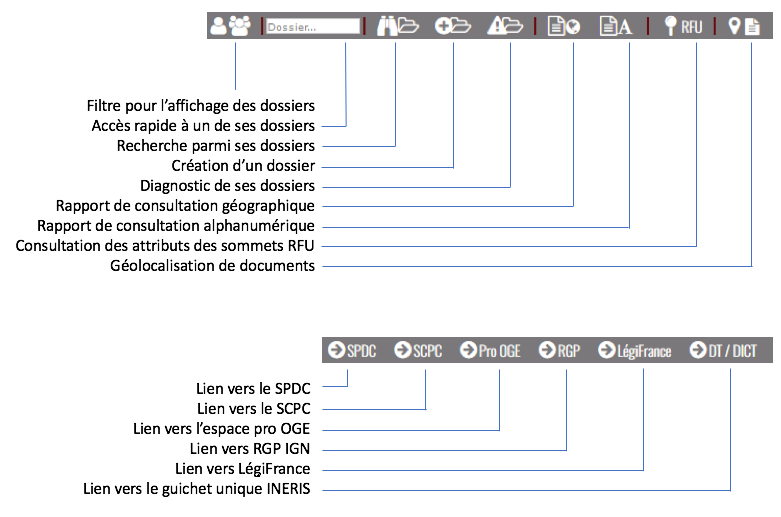

Barres d’outils
===============

La plupart des fonctionnalités disponibles dans Géofoncier peuvent être lancées à partir des barres d’outils de l’interface. Les barres d’outils sont toujours visibles quelle que soit la configuration de l’interface.

Lorsque vous souhaitez lancer une commande, il suffit de cliquer sur le bouton qui convient. La commande est active lorsque le bouton apparaît en rouge:

|inactive| Commande inactive             |active| Commande active

.. |inactive| image:: _static/images/image279.png
   :align: middle
   :width: 23
.. |active| image:: _static/images/image280.png
   :align: middle
   :width: 23


Tous les boutons de la barre d’outils sont munis d’une info-bulle: il suffit de positionner le curseur de la souris quelque temps sur un bouton pour provoquer l’affichage d’un message rappelant le rôle de la commande.

.. image:: _static/images/image281.png
   :align: center
   :width: 200


Barre d’outils «standard»
-------------------------

La barre d’outils «standard» de couleur noire contient les accès aux fonctions de base de l’application: outils de navigation, de mesures, d’annotations, d’interrogation des couches de données.


Outils de navigation
^^^^^^^^^^^^^^^^^^^^

**Historique des vues**

|vue_precedente| ``Vue précédente`` : Permet de revenir à l’emprise de la vue précédente

.. |vue_precedente| image:: _static/images/image287.png

|zoom_territoire| ``Zoom sur territoire`` : permet de visualiser l’ensemble du territoire

.. |zoom_territoire| image:: _static/images/image288.png

|vue_suivante| ``Vue suivante`` : Permet de revenir à l’emprise de la vue suivante

.. |vue_suivante| image:: _static/images/image289.png

**Déplacement de la carte**

|pan| ``Déplacer la carte`` : permet de déplacer la carte par glisser-déposer

.. |pan| image:: _static/images/image290.png

Il est également possible d’utiliser les flèches directionnelles de votre clavier.

**Zoom avant / Zoom arrière**

|zoom| ``Zoom sur la carte`` : permet d’augmenter l’échelle de la carte (outil sélectionné par défaut lorsque vous vous connectez sur Géofoncier).

.. |zoom| image:: _static/images/image291.png

Sélectionner l’outil puis cliquer sur la carte: l’échelle immédiatement supérieure est sélectionnée

OU

Sélectionner l’outil puis dessiner un rectangle sur la carte: l’échelle la plus adaptée est sélectionnée

.. tip:: 

	.. image:: _static/images/image295.png
		:align: right

	Pour dessiner un rectangle de zoom :

	1. cliquer le point supérieur gauche du rectangle,

	2. en maintenant le clic gauche, déplacer le curseur à l’emplacement du point inférieur droit du rectangle,

	3. relâcher le clic.


|zoom_arriere| ``Zoom arrière`` : permet de passer à l’échelle inférieure

.. |zoom_arriere| image:: _static/images/image296.png

Sélectionner l’outil : l’échelle immédiatement inférieure est sélectionnée.

Il existe deux autres façons de changer l’échelle de la carte:

* Soit en utilisant les touche «+» et «-» de votre clavier,

* Soit en utilisant la molette de votre souris


.. caution:: **L’usage de la molette doit se faire avec parcimonie** : il est conseillé de la tourner cran par cran. Si vous tournez la molette trop rapidement, les données mettront plus de temps à se charger car plusieurs zooms avants / zooms arrières seront lancés simultanément.


Outil d’accès à Google Street View
^^^^^^^^^^^^^^^^^^^^^^^^^^^^^^^^^^

L’outil Street View permet d’afficher dans un nouvel onglet le panorama Google Street View correspondant à la position du point cliqué.

1. Sélectionner l’outil puis cliquer sur la carte à l’endroit souhaité

2. Le panorama Street View se charge dans un nouvel onglet.

.. image:: _static/images/image298.png


.. note:: Lorsque l’outil Street View est sélectionné, un curseur de ce type |cursor_select| apparaît.

.. |cursor_select| image:: _static/images/image301.png
    :width: 30


.. tip:: S'il n’existe pas de données Street View à l’endroit du point cliqué, un écran noir s’affiche.


Outil d’interrogation des couches de données
^^^^^^^^^^^^^^^^^^^^^^^^^^^^^^^^^^^^^^^^^^^^

.. image:: _static/images/image304.png
   :align: right

L’outil d’interrogation permet d’interroger les couches de données présentes à l’écran. Une flèche descendante située à droite du bouton vous permet de faire apparaitre la liste des couches de données interrogeables.

.. important:: Seules les couches actives dans la liste des couches de données sont interrogeables.


|interro_dossier| Interrogation de la couche «Dossiers»
````````````````````````````````````````````````````````
.. |interro_dossier| image:: _static/images/image307.png


Sélectionner l’outil puis cliquer sur le localisant d’un dossier ou dessiner un rectangle sur la carte. Les informations s’affichent dans le volet «Résultats» situé dans le bandeau gauche. Lorsque le dossier dispose d’un polygone d’emprise, celui-ci est automatiquement affiché lors de l’interrogation du dossier.

.. image:: _static/images/image304.png
   :align: right


.. tip:: La couche «Dossiers» du thème «Géomètres-Experts» doit être active (couche active par défaut).

.. note:: La couche «Dossiers» est visible des échelles 1/500 à 1/30 000.

.. note:: Lorsque l’outil «Interroger dossiers» est sélectionné, un curseur de ce type |cursor_select| apparaît.

L’interrogation d’un localisant d’un dossier provoque l’affichage de la fiche dossier dans le volet résultat.

.. image:: _static/images/image313bis.png
   :align: center


Une puce s’affiche sur l’identifiant du dossier.

Si plusieurs résultats sont trouvés, une fenêtre pop-up s’affiche alors indiquant le nombre de dossiers identifiés.

.. image:: _static/images/image315.png
   :align: center

Le dossier le plus récent est affiché. Une barre d’outils permet alors de passer en revue les différents dossiers.

.. image:: _static/images/image317.png
   :align: center


|dpr| Dossier plus récent

|dpa| Dossier plus ancien

|dp| Dossier précédent

|ds| Dossier suivant

.. |dpr| image:: _static/images/image319.png
.. |dpa| image:: _static/images/image321.png
.. |dp| image:: _static/images/image323.png
.. |ds| image:: _static/images/image321.png

Dans le cas de l’interrogation des logos de la couche «dossiers», outre les informations du dossier accessibles à tous les utilisateurs, deux à quatre boutons s’affichent :

Le bouton |btn_contact| ouvre dans un nouvel onglet la page de l’annuaire public de l’OGE contenant les coordonnées du cabinet détenteur du dossier. Ce bouton est accessible à tous les utilisateurs de Géofoncier.

.. |btn_contact| image:: _static/images/image327.png
.. image:: _static/images/image325.png
   :align: center
   :width: 600

Le bouton |btn_doc| permet d’accéder à la liste des documents dématérialisés attachés au dossier. Le survol de l'icône «aperçu» (|ico_apercu|) permet de visualiser la vignette du document. Un clic sur l'icône «obtenir» (|ico_obtenir|) vous permet alors de télécharger le document si vous en avez le droit.

.. |btn_doc| image:: _static/images/image331.png
.. |ico_apercu| image:: _static/images/image335.png
.. |ico_obtenir| image:: _static/images/image337.png
.. image:: _static/images/image333.png
   :align: center

.. note:: Ce bouton est accessible si et seulement si le dossier contient au moins un document dématérialisé.

**Si votre structure n’êtes pas détentrice du dossier**, les documents ne sont pas consultables. La liste des documents est néanmoins visible, et un aperçu des documents est disponible.

.. image:: _static/images/image338.png
   :align: center


**Si votre structure est détentrice du dossier**, les documents sont consultables en cliquant sur l’icône Obtenir sur la ligne du document souhaité. Le fichier pdf correspondant au document se télécharge dans un nouvel onglet.


Le bouton |btn_edit_dossier| permet d’accéder à la fiche dossier détaillée pour compléter / modifier des informations (cf. `Création de dossier <outils.html#creation-de-dossier>`_ )

.. |btn_edit_dossier| image:: _static/images/image342.png

.. image:: _static/images/image340.png
   :align: center
   :width: 400

Ce bouton est accessible uniquement si votre structure est détentrice du dossier.


Le bouton |rapport_consultation| vous permet d’éditer un rapport de
consultation individuel sous la forme d’un fichier PDF.

.. |rapport_consultation| image:: _static/images/image347.png

.. image:: _static/images/image348.png
   :align: center
   :width: 500


|interro_geodesie| Interrogation de la couche «Géodésie»
````````````````````````````````````````````````````````
.. |interro_geodesie| image:: _static/images/image350.png

Sélectionner l’outil puis cliquer sur un point géodésique pour charger sa fiche IGN en PDF.

.. image:: _static/images/image356bis.png
   :align: center

.. attention:: Au moins une des couches du thème «Géodésie» doit être active.

.. note:: Lorsque l’outil «Interroger géodésie» est sélectionnée, un curseur de ce type |cursor_select| apparaît.


|interro_da| Interrogation de la couche «Documents cadastraux»
``````````````````````````````````````````````````````````````
.. |interro_da| image:: _static/images/image361.png

Sélectionner l’outil puis cliquer sur le localisant d’un document cadastral pour en charger le PDF.

.. image:: _static/images/image368bis.png
   :align: center

.. attention:: La couche «Documents cadastraux» du thème «Géomètres-Experts» doit être active.

.. note:: Lorsque l’outil «Interroger documents cadastraux» est sélectionnée, un curseur de ce type |cursor_select| apparaît.


|interro_wms| Interrogation des «couches interrogeables»
````````````````````````````````````````````````````````
.. |interro_wms| image:: _static/images/image370.png

Sélectionner l’outil puis cliquer sur la carte, les résultats de l’interrogation s’affichent dans le volet «Résultats».

.. note:: Lorsque l’outil «Interroger couches» est sélectionnée, un curseur de ce type |cursor_select| apparaît.

.. image:: _static/images/image372.png
   :align: center

Il est nécessaire que des couches interrogeables soient actives telles que par exemple une ou plusieurs couches du thème «environnement» (cf. `Annexe 2 - Liste des couches de données interrogeables <annexes.html#liste-des-couches-de-donnees-interrogeables>`_).

Il est également possible d’interroger des WMS importés par l’utilisateur par l’outil «Charger une couche WMS», si ces WMS sont interrogeables. (cf. `Annexe 1 - Liste de serveurs WMS compatibles avec Géofoncier <annexes.html#liste-des-couches-de-donnees-interrogeables>`_)


Outils de mesures
^^^^^^^^^^^^^^^^^

Géofoncier vous propose des outils de mesures pour obtenir une estimation de distances, de surfaces ou de rayons.

.. image:: _static/images/image374.png
   :align: right

Une flèche descendante située à droite du bouton vous permet de faire apparaitre une liste contenant quatre actions possibles. Lors d’un clic sur «Distance» ou «Surface» ou «Rayon», l’icône de la barre d’outils se met à jour pour vous permettre d’accéder plus rapidement à la commande.

**Mesure de distance** |distance|

.. |distance| image:: _static/images/image376.png

Sélectionner l’outil, puis cliquer sur la carte les extrémités dessegments à mesurer. Les distances partielles (en gris) et la distancecumulée (en rouge) s’affichent dynamiquement.

Un double-clic permet d’arrêter la mesure. Les distances restent alors affichées.

+-------------------------------------------+-------------------------------------------+
|  .. image:: _static/images/image378.png   |  .. image:: _static/images/image380.png   |
|    :align: center                         |    :align: center                         |
|    :width: 300                            |    :width: 300                            |
|                                           |                                           |
+-------------------------------------------+-------------------------------------------+
|  *Situation en cours de digitalisation*   |  *Situation finale après double-clic*     |
+-------------------------------------------+-------------------------------------------+


.. note:: Les valeurs arrondies au mètre données par l’application sont indicatives.

**Mesure de surface** |surface|

.. |surface| image:: _static/images/image383.png

Sélectionner l’outil, puis cliquer sur la carte les sommets de la surface à mesurer. Les distances partielles (en gris), la distance cumulée (en rouge) et le périmètre (en rouge) s’affichent dynamiquement.

Un double-clic permet d’arrêter la mesure. Les distances et surfaces restent alors affichées.

+-------------------------------------------+-------------------------------------------+
|  .. image:: _static/images/image385.png   |   .. image:: _static/images/image387.png  |
|    :align: center                         |     :align: center                        |
|    :width: 300                            |     :width: 300                           |
|                                           |                                           |
+-------------------------------------------+-------------------------------------------+
|    *Situation en cours de digitalisation* |     *Situation finale après double-clic*  |
+-------------------------------------------+-------------------------------------------+

.. note:: Les valeurs arrondies au mètre et au mètre carré données par l’application sont indicatives.

**Mesure de rayon** |rayon|

.. |rayon| image:: _static/images/image389.png

Sélectionner l’outil, puis cliquer sur la carte le centre du rayon à mesurer. La mesure du rayon s’affiche dynamiquement en rouge.

Un double-clic permet d’arrêter la mesure. Le rayon reste alors affiché.

+-------------------------------------------+-------------------------------------------+
|  .. image:: _static/images/image391.png   |   .. image:: _static/images/image393.png  |
|    :align: center                         |     :align: center                        |
|    :width: 300                            |     :width: 300                           |
|                                           |                                           |
+-------------------------------------------+-------------------------------------------+
|    *Situation en cours de digitalisation* |     *Situation finale après double-clic*  |
+-------------------------------------------+-------------------------------------------+

.. note:: Les valeurs arrondies au mètre données par l’application sont indicatives.

**Effacer les mesures** |effacer|

.. |effacer| image:: _static/images/image395.png


Cette action permet de supprimer de la carte des mesures qui viennent d’être effectuées.

Toutes les mesures que vous effectuez sur la carte sont «persistantes». Elles restent affichées tant que vous ne les effacez pas.


Outil permalien
^^^^^^^^^^^^^^^

Géofoncier vous permet de disposer d’un raccourci vers une vue sous forme de lien Internet.

|permalien| La sélection de cet outil provoque l’affichage d’une fenêtre «Permalien»:

.. |permalien| image:: _static/images/image396.png

.. image:: _static/images/image398.png
   :align: center

Un simple copier-coller de l’URL indiqué vous permet de «mémoriser» la position de la carte courante. Les informations suivantes sont consignées dans l’URL:

* Emprise de la carte

* Couches de données affichées (option à cocher)


Le bouton |btn_perma_mail| permet d’envoyer le permalien par courriel.

.. |btn_perma_mail| image:: _static/images/image400.png

.. tip:: Cette fonction est particulièrement utile pour transmettre par courriel une vue Géofoncier.

Le bouton |btn_perma_marqueur| permet d’ajouter un marqueur au lien

.. |btn_perma_marqueur| image:: _static/images/image402.png


Pour ajouter un marqueur sur la carte, il suffit de cliquer sur le bouton correspondant et de cliquer à l’endroit souhaité pour le marqueur

+-------------------------------------------+-------------------------------------------+
|  .. image:: _static/images/image404.png   |   .. image:: _static/images/image406.png  |
|    :align: center                         |     :align: center                        |
|    :width: 300                            |     :width: 300                           |
|                                           |                                           |
+-------------------------------------------+-------------------------------------------+
|    *Positionnement du marqueur*           |     *Marqueur ajouté à la carte*          |
+-------------------------------------------+-------------------------------------------+

Le bouton |btn_del_marqueur| permet d'enlever le marqueur du lien

.. |btn_del_marqueur| image:: _static/images/image408.png

.. attention:: Lorsque vous ouvrez un permalien, Géofoncier vérifie que vous disposez bien des droits pour afficher les couches demandées.

Outil d’impression
^^^^^^^^^^^^^^^^^^

Géofoncier vous permet d’éditer un fichier PDF de la vue courante.

|btn_print| La sélection de cet outil provoque l’affichage d’une fenêtre «Exporter la vue en PDF».

.. |btn_print| image:: _static/images/image411.png

.. image:: _static/images/image413.png
   :align: right

Il est possible de paramétrer certains éléments du fichier de sortie : titre du document, format, orientation et échelle.

Lorsque vous cliquez sur «Imprimer», une barre de progression apparaît le temps de générer le document. Lorsque l’opération est finie, l’application affiche une fenêtre pop-up pour ouvrir ou enregistrer le PDF.

.. image:: _static/images/image415.png
   :align: center
   :width: 300

.. image:: _static/images/image417.png
   :align: center

L’emprise de la zone à imprimer peut être ajustée à l’écran en déplaçant le rectangle de prévisualisation. Pour cela il convient de cliquer à l’intérieur du rectangle, et en maintenant le clic gauche, de déplacer le rectangle dans la zone souhaitée. La modification de l’échelle met à jour instantanément le cadre de prévisualisation.


Outil de chargement de couches de données supplémentaires
^^^^^^^^^^^^^^^^^^^^^^^^^^^^^^^^^^^^^^^^^^^^^^^^^^^^^^^^^

Géofoncier dispose d’un connecteur WMS [1]_ vous permettant de charger des couches de données supplémentaires pour un usage ponctuel.

|btn_add_wms| La sélection de cet outil provoque l’affichage d’une fenêtre «Charger une couche WMS»

.. |btn_add_wms| image:: _static/images/image419.png

.. image:: _static/images/image421.png
   :align: center
   :width: 300

+-------------------------------------------+-------------------------------------------+
|  .. image:: _static/images/image423.png   |   .. image:: _static/images/image424.png  |
|    :align: center                         |     :align: center                        |
|    :width: 300                            |     :width: 300                           |
+-------------------------------------------+-------------------------------------------+

Après avoir renseigné l’URL d’un serveur WMS (attention à ne pas oublier le ? à la fin de l’URL), il suffit de cliquer sur le bouton «OK» pour lister les couches de données proposées par le serveur. Lors du clic sur le nom d’une couche, une nouvelle couche est ajoutée automatiquement à l’arbre des couches de Géofoncier. Dès lors, cette couche de données est manipulable comme tout autre couche de Géofoncier (cf. `Affichage des couches de données <interface.html#gestion-de-l-affichage-des-couches-de-donnees>`_ ).

Dans une même session, il est possible de charger ainsi plusieurs couches WMS.

L’accès à la légende de la couche ajoutée se fait en survolant le nom de la couche (cf. `Affichage des couches de données <interface.html#gestion-de-l-affichage-des-couches-de-donnees>`_ )

.. tip:: Seules les couches de données servies en EPSG:4326 (coordonnées géographiques WGS84) ou EPSG:3857 (projection Mercator) peuvent être chargées dans Géofoncier.

.. note:: Un catalogue de lien WMS est fourni en annexe à ce guide utilisateur.

.. attention:: L’outil permalien ne permet pas de «mémoriser» les couches WMS.

.. [#] Web Map Service (WMS) est une norme pour les flux de données géographiques géoréférencées. Vous trouverez une explication détaillée de ce concept à l’adresse suivante : http://fr.wikipedia.org/wiki/Web_Map_Service

Outil de chargement de fichier vecteur
^^^^^^^^^^^^^^^^^^^^^^^^^^^^^^^^^^^^^^

Géofoncier dispose d’un lecteur de fichier vecteur vous permettant de charger ponctuellement des formes vectorielles.

|btn_kml| La sélection de cet outil provoque l’affichage d’une fenêtre «Lecteur KML / GPX »

.. |btn_kml| image:: _static/images/image428.png

Après avoir sélectionné un fichier situé sur votre ordinateur (bouton «Parcourir»), un clic sur le bouton «Importer» permet de charger les objets géographiques dans une couche temporaire de Géofoncier.

Une nouvelle couche de données s’affiche alors dans la liste: «Import KML-GPX».

.. image:: _static/images/image430.png
   :align: center
   :width: 300

+-------------------------------------------+-------------------------------------------+
|  .. image:: _static/images/image434.png   |   .. image:: _static/images/image432.png  |
|    :align: center                         |     :align: center                        |
|    :width: 300                            |     :width: 300                           |
+-------------------------------------------+-------------------------------------------+

.. note:: Seuls les formats KML et GPX sont gérés par cet outil. Les géométries doivent être exprimées en coordonnées géographiques WGS84.

.. note:: Le format KML est principalement utilisé par le logiciel grand public Google Earth. Le format GPX est principalement utilisé par les appareils nomades grand public dits «GPS de randonnée».


Changement de territoire
^^^^^^^^^^^^^^^^^^^^^^^^

Un clic sur le bouton |territoire| permet d’afficher une liste déroulante et de sélectionner l’un des 8 territoires gérés par Géofoncier

.. |territoire| image:: _static/images/image436.png

.. image:: _static/images/image437.png
   :align: center
   :width: 200

Géofoncier mémorise systématiquement le territoire que vous «visitez». Si vous changez de territoire et vous déconnectez, vous le retrouverez à votre prochaine connexion.

.. attention:: Dans l’hypothèse où votre compte Géofoncier est utilisé par plusieurs personnes simultanément, si l’une d’entre elles change de territoire, les autres utilisateurs constateront des disfonctionnements.


Barre d’outils «géomètre-expert»
--------------------------------

La barre d’outils «géomètre-expert» de couleur grise rassemble l’ensemble des fonctionnalités métiers accessibles uniquement aux géomètres-experts. Cette barre d’outils contient notamment les fonctions de recherche et de création de dossier.




Filtrage de l’affichage des localisants des dossiers
^^^^^^^^^^^^^^^^^^^^^^^^^^^^^^^^^^^^^^^^^^^^^^^^^^^^

Cette commande vous permet de filtrer l’affichage des localisants des dossiers:

|filtre1| Tous les dossiers sont affichés

|filtre2| Seuls les dossiers dont je ne suis pas détenteur sont affichés

|filtre3| Seuls les dossiers dont je suis détenteur sont affichés

.. |filtre1| image:: _static/images/image457.png
.. |filtre2| image:: _static/images/image459.png
.. |filtre3| image:: _static/images/image461.png


.. tip:: Pour interroger un dossier (logo), se référer à la section `Interrogation couche dossier <outils.html#interro-dossier-interrogation-de-la-couche-dossiers>`_  |logo_dossier| |int_logo_dossier|

.. |logo_dossier| image:: _static/images/image463.png
.. |int_logo_dossier| image:: _static/images/image464.jpg

Accès rapide à un de ses dossiers
^^^^^^^^^^^^^^^^^^^^^^^^^^^^^^^^^

|acces_rapide| Cet outil vous permet d’accéder rapidement à un de vos dossiers.

.. |acces_rapide| image:: _static/images/image465.png

Après avoir saisie la référence d’un dossier, quatre cas peuvent se présenter à vous:

1. Le dossier indiqué existe dans votre base Géofoncier.

La carte se centre sur le polygone d’emprise du dossier ou, à défaut, ses localisants. La fiche d’information du dossier s’affiche (cf. `Interrogation couche dossier <outils.html#interro-dossier-interrogation-de-la-couche-dossiers>`_ ) et le polygone d’emprise du dossier s’affiche s’il en est pourvu.

2. Le dossier indiqué n’existe pas dans votre base Géofoncier: un message vous en informe.

.. image:: _static/images/image467.png
   :align: center
   :width: 200

3. Le dossier indiqué n’est pas localisé: la fiche d’information du dossier s’affiche sans et la carte zoome, le cas échéant sur l'emprise des parcelles cadastrales dont le dossier peut être pourvu.

.. image:: _static/images/image469.png
   :align: center
   :width: 200

4. Il existe plusieurs occurrences de la référence dossier (même référence avec des structures créatrices différentes) : une fenêtre s’affiche alors pour vous demander de choisir le dossier qui vous intéresse.


.. note::
	|dossier_vert| Lorsque le dossier indiqué existe dans la base, l’outil «accéder rapidement à un dossier» s’affiche en vert.

	|dossier_orange| Lorsque le dossier indiqué existe dans la base et n'est pas localisé, l’outil «accéder rapidement à un dossier» s’affiche en orange.

	|dossier_rouge| Lorsque le dossier indiqué n’existe pas dans la base, l’outil «accéder rapidement à un dossier» s’affiche en rouge.

.. |dossier_vert| image:: _static/images/image471.png
.. |dossier_orange| image:: _static/images/image472.png
.. |dossier_rouge| image:: _static/images/image474.png


Recherche parmi ses dossiers
^^^^^^^^^^^^^^^^^^^^^^^^^^^^

Sous Géofoncier, la recherche des dossiers se fait principalement par la cartographie. Il est toutefois possible d’effectuer des recherches alphanumériques uniquement sur les seuls dossiers dont l’utilisateur est détenteur.

Le bouton |recherche| provoque l’affichage de la fenêtre de recherche de dossiers.

.. |recherche| image:: _static/images/image475.png

.. image:: _static/images/image481bis.png
   :align: center

**ZONE 1** : Critère de recherche

**ZONE 2** : Bouton pour lancer / Réinitialiser la recherche

**ZONE 3** : Affichage des résultats d’une recherche

**ZONE 4** : Navigation dans les pages de résultats

**ZONE 5** : Actions sur les résultats

.. note::
	.. image:: _static/images/image483.png
   		:align: right

	En cliquant directement sur le bouton «Rechercher» en bas à gauche de la fenêtre, vous obtenez le nombre de vos dossiers présents sur Géofoncier ainsi que la liste de l’ensemble de ces dossiers (zone 3).


**Critères de recherche**

Lors de la recherche, les dossiers sont filtrés selon une liste de critères.

.. image:: _static/images/image485.png
   	:align: right

``Dossiers`` : permet d’accéder rapidement à un dossier.

``Créateur`` : permet de restreindre la recherche à un géomètre-expert et/ou à un cabinet créateur donnée (cas de plusieurs géomètres-experts et/ou rachat de cabinets).

``Localisation`` : permet de restreindre la recherche à une commune.

``Date`` : permet de restreindre la recherche à une plage de dates. Pour la saisie des dates, il faut afficher le calendrier (|calendrier|).

``Type de travaux`` : permet de restreindre la recherche à un type d’opération (famille et/ou type).

``Plan cadastral`` : permet de restreindre la recherche à une référence cadastrale et/ou à une référence DMPC.

``Divers`` : permet de restreindre la recherche sur les caractéristiques des dossiers.

``Clients`` : permet de restreindre la recherche sur les dossiers accessibles par un client particulier.

L’ensemble des critères de recherches disponibles sont cumulatifs.

.. |calendrier| image:: _static/images/image487.png 

.. note::
	.. image:: _static/images/image488.png
   		:align: right
	
	Lorsque vous tapez les premières lettres d’une référence de dossier, d’une commune, d’une référence cadastrale ou d’un code client, une liste apparait pour vous proposer les choix possibles parmi les données existantes. Il faut alors bien prendre soin à cliquer un élément dans la liste.

**Bouton pour lancer / Réinitialiser la recherche**

Le bouton |btn_rechercher| permet de lancer la recherche parmi vos dossiers

Le bouton |btn_reinit| permet de réinitialiser les critères de recherche

.. |btn_rechercher| image:: _static/images/image490.png 
.. |btn_reinit| image:: _static/images/image491.png 


**Navigation dans les pages de résultats**

.. image:: _static/images/image492.png
	:align: center
   	:width: 200


Cette barre permet de naviguer aisément parmi les différentes pages de résultats. Pour accéder directement à une page donnée de résultats, saisir le numéro de la page et appuyer sur la touche entrée du clavier.

|result1| Accéder à la première page de résultats

|result2| Accéder à la page précédente

|result3| Numéro de la page en cours

|result4| Accéder à la page suivante

|result5| Accéder à la dernière page

|result6| Actualisation des résultats

.. |result1| image:: _static/images/image494.png 
.. |result2| image:: _static/images/image496.png 
.. |result3| image:: _static/images/image498.png 
.. |result4| image:: _static/images/image500.png 
.. |result5| image:: _static/images/image502.png 
.. |result6| image:: _static/images/image504.png 

**Tri des résultats**

Pour trier la liste des résultats, il suffit de cliquer sur l’en-tête d’une colonne (tri par numéro de dossier, date de création ou commune).

+-------------------------------------------+-------------------------------------------+
|  .. image:: _static/images/image506.png   |   .. image:: _static/images/image507.png  |
|    :align: center                         |     :align: center                        |
|    :width: 200                            |     :width: 200                           |
|                                           |                                           |
+-------------------------------------------+-------------------------------------------+
|    *Tri ascendant*                        |     *Tri descendant*                      |
+-------------------------------------------+-------------------------------------------+

Le tri est ascendant lors du premier clic puis descendant lors du second clic. Une petite flèche à droite de l’en-tête de la colonne vous indique quel tri est appliqué.

Il est également possible de choisir directement l’ordre de tri à appliquer en cliquant sur la flèche à droite de l’en-tête de la colonne. Cette flèche s’affiche lorsque le curseur de la souris est situé sur l’en-tête de ladite colonne.

.. image:: _static/images/image510.png
	:align: center
   	:width: 300


**Actions sur les résultats**

Le bouton |ouvrir_dossier| permet d’éditer un dossier après l’avoir sélectionné

Le bouton |supprime_dossier| permet de supprimer un dossier sélectionné après avoir passé l’avertissement

.. |ouvrir_dossier| image:: _static/images/image512.png 
.. |supprime_dossier| image:: _static/images/image514.png 

.. attention:: Supprimer un dossier le supprime définitivement. Les informations du dossier et les documents joints seront perdus. Cette fonction ne doit être utilisée que pour supprimer un dossier dont la référence est erronée.

.. note:: 
	La suppression d’un dossier n’est possible que si l’utilisateur dispose des droits suffisants. Dans le cas contraire, une fenêtre s’affiche.

	.. image:: _static/images/image516.png
		:align: center
	   	:width: 300

Le bouton |btn_export_excel| permet d’exporter la liste des résultats sous la forme d’un fichier Microsoft Excel

.. |btn_export_excel| image:: _static/images/image518.png 


Création de dossier
^^^^^^^^^^^^^^^^^^^

La fonction de création de dossiers vous permet de géolocaliser vos dossiers dans Géofoncier. L’obligation ordinale de géolocalisation des dossiers s’applique aux types d’opérations suivants:

+---------------+----------------------------------+-------------------------------------------------------------------+
| CODE          | FAMILLE                          | OPÉRATION                                                         |
+===============+==================================+===================================================================+
| Ca            | AMÉNAGEMENT FONCIER              | Aménagement Foncier Agricole et Forestier (AFAF)                  |
+---------------+----------------------------------+-------------------------------------------------------------------+
| Cb            | AMÉNAGEMENT FONCIER              | Échanges et cessions amiables d’immeubles ruraux (ECIR)           | 
|               |                                  | ou forestiers (ECIF)                                              |
+---------------+----------------------------------+-------------------------------------------------------------------+
| Ea            | FONCIER                          | Délimitation de la propriété des personnes publiques              |
+---------------+----------------------------------+-------------------------------------------------------------------+
| Eb            | FONCIER                          | Bornage et reconnaissance de limites (mitoyenneté...)             |
+---------------+----------------------------------+-------------------------------------------------------------------+
| Ec            | FONCIER                          | Division et partage de propriété (DMPC...)                        |
+---------------+----------------------------------+-------------------------------------------------------------------+
| Ee            | FONCIER                          | Voirie (alignement, classement, voirie communale,                 |
|               |                                  | chemins ruraux, d’exploitation...)                                |
+---------------+----------------------------------+-------------------------------------------------------------------+
| Ef            | FONCIER                          | Documents cadastraux et publicité foncière                        |
|               |                                  | (rénovation, remaniement, numérisation,                           |
|               |                                  | régime particulier d’Alsace Moselle)                              |
+---------------+----------------------------------+-------------------------------------------------------------------+
| Ei            | FONCIER                          | Servitudes attachées à la propriété                               |
+---------------+----------------------------------+-------------------------------------------------------------------+
| Fa            | COPROPRIÉTÉ / DIVISION EN VOLUME | Copropriété : état descriptif de division                         |
+---------------+----------------------------------+-------------------------------------------------------------------+
| Fb            | COPROPRIÉTÉ / DIVISION EN VOLUME | Copropriété : règlement de copropriété                            |
+---------------+----------------------------------+-------------------------------------------------------------------+
| Fc            | COPROPRIÉTÉ / DIVISION EN VOLUME | Copropriété : Divisions en volume                                 |
+---------------+----------------------------------+-------------------------------------------------------------------+


.. note:: Le choix de procéder à la géolocalisation de l’ensemble de vos dossiers est laissé à votre libre appréciation. Tous les types de dossiers peuvent être saisis dans Géofoncier.

Le bouton |nouveau_dossier| permet de créer un nouveau dossier

.. |nouveau_dossier| image:: _static/images/image521.png 

.. tip:: Avant de sélectionner cette fonction, localisez-vous à l’endroit où vous souhaitez positionner le localisant du dossier.

1. Cliquer sur le bouton |nouveau_dossier|

2. Cliquer à l’endroit de la carte où vous souhaitez voir apparaitre le localisant. Un curseur en forme de flèche et de dossier apparaît.

3. Une fenêtre s’ouvre :

.. image:: _static/images/image524.png
	:align: right
   	:width: 300

* Le cabinet créateur est automatiquement complété, vous pouvez toutefois en choisir un autre dans la liste (cas de reprise de cabinet(s) ou de changement de société)

* Le cabinet détenteur est automatiquement complété

* Le code INSEE et le nom de la commune sont automatiquement complétés

* La liste des géomètres-experts créateur est automatiquement complétée avec les noms des géomètres-experts en exercice dans votre structure

4. Il vous reste à renseigner :

* La référence du dossier

* Le géomètre-expert créateur (s’il s’agit d’une personne ayant cessé son activité, il vous faut selectionner le cabinet createur approprié)

* La date de création du dossier (la sélection de la date se fait en cliquant sur l’icône en forme de calendrier (|calendrier|))

.. image:: _static/images/image526.png
	:align: right
   	:width: 250

* Le type d’opération

Le choix du type d’opération s’effectue de façon intuitive en sélectionnant la famille et le type d’opération dans une fenêtre.

+-------------------------------------------+-------------------------------------------+
|  .. image:: _static/images/image528.png   |   .. image:: _static/images/image529.png  |
|    :align: center                         |     :align: center                        |
|    :width: 300                            |     :width: 300                           |
|                                           |                                           |
+-------------------------------------------+-------------------------------------------+

Vous pouvez ajouter autant de type d’opération que vous souhaitez avec l’icône |icone_ajouter|. Vous pouvez également supprimer un type d’opération avec l’icône |icone_supprimer|. Les opérations à versement obligatoire apparaissent en gras.

.. |icone_ajouter| image:: _static/images/image532.png 
.. |icone_supprimer| image:: _static/images/image533.png 

.. image:: _static/images/image534.png
	:align: center
   	:width: 200

5. Cliquer sur le bouton «Valider» :

Cela a pour effet de créer le localisant et d’ouvrir la fiche dossier en mode «édition».

.. figure:: _static/images/image535.png
	:align: center
   	:width: 400

	*Informations minimales d’un dossier*

.. tip:: 
	Arrivé à cette étape, vous avez renseigné les informations minimales d’un dossier. Il vous suffit dès lors de valider la fiche pour que le dossier soit immédiatement rendu disponible dans la couche «Dossiers».
	Nous vous conseillons toutefois de poursuivre la saisie d’informations complémentaires.

.. note:: Il est possible de revenir à cette fiche à tout moment:

	* Soit par l’ouverture d’un dossier suite à une recherche de dossiers (cf. `Accès rapide au dossier <outils.html#acces-rapide-a-un-de-ses-dossiers>`_).

	* Soit par le bouton «Modifier ou compléter le dossier» (cf. `Interrogation couche dossier <outils.html#interro-dossier-interrogation-de-la-couche-dossiers>`_ ).


6. Renseigner des informations supplémentaires sur le dossier (onglet Informations):

.. image:: _static/images/image526.png
	:align: right
   	:width: 200

* Vous pouvez ajouter / supprimer des opérations avec les icônes |icone_ajouter| et |icone_supprimer|. Les activités auxquelles sont rattachées des opérations à versement obligatoire et les opérations à versement obligatoire apparaissent en gras.

.. image:: _static/images/image540.png
	:align: right
   	:width: 200

* Vous pouvez ajouter / supprimer des références cadastrales avec les icônes |icone_ajouter| et |icone_supprimer|. Il est possible d’indiquer une plage de numéros de parcelle.


.. tip:: Dans le cas de division parcellaire, Géofoncier ne fait pas de distinction entre les parcelles «mères» et les parcelles «filles»; il est recommandé de les saisir indifféremment.

.. image:: _static/images/image543.png
	:align: right
   	:width: 200

* Vous pouvez ajouter / supprimer des références DMPC avec les icônes |icone_ajouter| et |icone_supprimer|. Une référence DMPC se compose d’un préfixe et de chiffres suivis d’une lettre majuscule.

.. note:: Dans le cas de travaux fonciers donnant lieu à division parcellaire, la saisie des références DMPC est obligatoire.

* Vous pouvez ajouter / déplacer / modifier / supprimer des localisants avec les icônes |icone_ajouter|, |icone_oeil|, |icone_deplacer| et |icone_supprimer| 

.. |icone_oeil| image:: _static/images/image547.png 
.. |icone_deplacer| image:: _static/images/image548.png 

|icone_ajouter|  Ajout d’un localisant au dossier : la fenêtre se minimise pour vous permettre de cliquer la position du localisant sur la carte.

|icone_oeil| Localiser un localisant : au clic, la carte se centre sur le localisant

|icone_deplacer| Déplacer un localisant : cet outil permet de modifier la position d’un localisant. Une icône en forme de crayon apparaît alors. Il suffit de cliquer sur la nouvelle position du localisant pour déplacer celui-ci.

|icone_supprimer| Supprimer un localisant . Attention il doit toujours rester au moins un localisant!

.. tip:: L’ajout de localisants peut être pratique pour des chantiers linéaires: levés de corps de rues, délimitations de voirie plusieurs logos sont alors positionnés le long de la voie.

* Vous pouvez ajouter / modifier / supprimer un polygone d’emprise

|btn_saisir_polygone| Création du polygone d’emprise

.. |btn_saisir_polygone| image:: _static/images/image550.png 


Pour créer un polygone, cliquer sur le bouton, puis cliquer les sommets du polygone sur la carte. Il faut double-cliquer pour terminer la saisie.

Le polygone en cours de saisie apparaît en bleu clair. Après saisie, il apparaît en orange.

Une fenêtre d’aide s’affiche avant de commencer la saisie.

.. image:: _static/images/image552.png
	:align: center
   	:width: 400


+--------------------------------------------------+---------------------------------------------------+
|  .. image:: _static/images/image554.png          |  .. image:: _static/images/image556.png           |
|    :align: center                                |    :align: center                                 |
|    :width: 200                                   |    :width: 200                                    |
|                                                  |                                                   |
+--------------------------------------------------+---------------------------------------------------+
|    *Saisie du polygone d’emprise en cours*       |    *Fin de la saisie du polygone d’emprise*       |
+--------------------------------------------------+---------------------------------------------------+
|  .. image:: _static/images/image558.png          |  .. image:: _static/images/image560.png           |
|    :align: center                                |    :align: center                                 |
|    :width: 200                                   |    :width: 200                                    |
|                                                  |                                                   |
+--------------------------------------------------+---------------------------------------------------+
|    *Saisie du polygone d’emprise à main levée*   |    *Saisie d’un trou dans le polygone d’emprise*  |
|                                                  |                                                   |
|    *(avec la touche Maj)*                        |    *(avec la touche Alt)*                         |
+--------------------------------------------------+---------------------------------------------------+

.. tip:: Il est possible de créer plusieurs polygones d’emprise par dossier.

Lorsque le polygone est créé, deux autres boutons apparaissent«Modification du polygone d’emprise» et «Suppression du polygone d’emprise».

|modif_emprise| **Modification du polygone d’emprise**

.. |modif_emprise| image:: _static/images/image562.png 

Pour modifier un polygone, cliquer sur le bouton, puis cliquer sur le polygone à modifier. Le polygone sélectionné apparaît en bleu foncé. Pour déplacer un sommet, il faut cliquer dessus et maintenir le clic tout en déplaçant le sommet avec la souris. En cliquant à l’extérieur du polygone, les modifications sont validées.

Une fenêtre d’aide s’affiche avant de commencer la saisie.

.. image:: _static/images/image564.png
	:align: center
   	:width: 400

.. figure:: _static/images/image566.png
	:align: center
   	:width: 400

	*Modification en cours du polygone d’emprise*

|suppr_emprise| **Suppression du polygone d’emprise**

.. |suppr_emprise| image:: _static/images/image568.png 

Pour supprimer un polygone, cliquer sur le bouton, puis cliquer sur le polygone à supprimer. Le polygone sélectionné apparaît en bleu foncé. Il suffit ensuite de confirmer pour rendre la suppression effective.

.. figure:: _static/images/image570.png
	:align: center
   	:width: 250

.. tip:: La notion de polygone d’emprise est particulièrement adaptée pour les opérations d’aménagements (lotissements ) ou pour les opérations topographiques (étendue d’un plan topographique...)

|load_emprise| **Chargement du polygone d’emprise**

.. |load_emprise| image:: _static/images/image572.png 

(le bouton apparaît lorsque vous ouvrez un dossier contenant un polygone d’emprise)

* Enfin, il est possible de renseigner un mémo.

.. figure:: _static/images/image575bis.png
	:align: center
   	:width: 500

	*Exemple d’une fiche dossier complétée de façon exhaustive*


* Les informations complémentaires sont des champs saisis via des logiciels utilisant l’API Géofoncier (ex: nom de l’opérateur du dossier, date du relevé terrain...). Ces informations ne sont accessibles **qu’aux seuls détenteurs du dossier**.


7. Joindre des documents dématérialisés (onglet Documents):

.. image:: _static/images/image577.png
	:align: center
   	:width: 500

Géofoncier vous permet d’attacher des documents de différents formats à vos dossiers. Cela est particulièrement utile pour joindre les procès-verbaux et plans de bornage que vous réalisez, qui par ailleurs font partie des obligations ordinales.

.. note:: Les documents que vous versez sur Géofoncier ne sont visibles que par vous (détenteur du dossier), vos collaborateurs et les conseils régionaux de l’OGE.

Pour procéder à l’envoi d’un document sur Géofoncier, il vous suffit de suivre la procédure:

1. Cliquer sur le bouton parcourir pour aller chercher le document situé sur votre ordinateur. Le taille du fichier doit être inférieure ou égale à 10 Mo.

2. Spécifier ensuite la nature du document en le choisissant dans la liste. Les types de document à versement obligatoire apparaissent en gras.

3. (Facultatif) Indiquer la description du document et choisir éventuellement de le rendre visible par les clients du dossier.

4. Cliquer finalement sur «Attacher».

+-------------------------------------------+-------------------------------------------+
|  .. image:: _static/images/image579.png   |   .. image:: _static/images/image581.png  |
|    :align: center                         |     :align: center                        |
|    :width: 250                            |     :width: 250                           |
|                                           |                                           |
+-------------------------------------------+-------------------------------------------+


Après un temps de chargement, le document est ajouté à la liste. Vous remarquerez que les documents sont systématiquement renommés de façon unique selon le principe suivant:

FR\_ ``code cabinet`` _ ``référence dossier`` _ ``code type`` _ ``numero d’index`` . ``extension``

Les documents sont immédiatement accessibles en ligne, il suffit de cliquer sur le nom d’un document pour le charger dans un nouvel onglet.

.. image:: _static/images/image583.png
	:align: center

Le bouton |icone_supprimer| au regard de chaque document permet de les supprimer un à un (suppression de la liaison au dossier et suppression du fichier sur le serveur).

La description de chaque document peut être éditée en cliquant sur la cellule correspondante.

L’état de la diffusion aux clients peut être changé en cliquant sur la case à cocher correspondante.


8. RFU :

Cet onglet vous informe si le dossier à fait l'objet d'un versement d'objets RFU.

L'ensemble des interventions liées à ce dossier sont listées.

.. image:: _static/images/image586.png
	:align: center
   	:width: 500


9. Définir la visibilité des dossiers :

.. image:: _static/images/image588.png
	:align: center
   	:width: 500


**Visibilité de la fiche info aux utilisateurs enregistrées** : option sélectionnable uniquement lorsque le dossier importé ne fait pas partie du périmètre obligatoire.

**Visibilité de la fiche info au grand public** : Les dossiers du périmètre non obligatoire ne sont pas accessibles sur la version grand public.

**Visibilité de la fiche info à vos clients** : 
Vous pouver ajouter / supprimer des codes clients avec les icônes |icone_ajouter| et |icone_supprimer|.

.. image:: _static/images/image590.png
	:align: center
   	:width: 250


10. Une fois toutes les informations saisies, il ne vous reste plus qu’à valider la fenêtre d’édition du dossier.

.. note:: Il vous est possible de revenir à tout instant sur un dossier pour le modifier ou le compléter.

.. attention:: **Pour être visible par les utilisateurs non géomètre et sur le site grand public, tout dossier du périmètre obligatoire créé après le 5 avril 2011 doit être localisé, disposer d’au moins un document dématérialisé et, le cas échéant, avoir fait l’objet d’un versement d’objet(s) RFU.**


Diagnostic de mes dossiers
^^^^^^^^^^^^^^^^^^^^^^^^^^

Géofoncier vous permet de connaître à tout instant l’état qualitatif de votre base dossier.

|btn_diagnostic| Ce bouton vous permet d’ouvrir une fenêtre vous donnant accès à des fonctionnalités de diagnostic de votre base dossier.

.. |btn_diagnostic| image:: _static/images/image592.png 


**Onglet «Anomalie»**

.. image:: _static/images/image594.png
	:align: center
   	:width: 500

.. important:: Les informations présentes dans cet onglet sont actualisées une fois par jour.

La partie gauche de l’écran liste les différents types d’anomalie potentielle que peuvent présenter vos dossiers et précise pour chacun d’eux le nombre de dossier concerné. Un code couleur permet de cibler rapidement les principales anomalies concernant vos dossiers:

* *blanc* : aucun dossier concerné
* *orange* : entre 1 et 20 dossiers sont concernés
* *rouge* : plus de 20 dossiers sont concernés

Les types d’anomalie rencontrés peuvent être les suivantes:

**Sans localisant** : les dossiers ne comportent aucun localisant, ils ne sont donc pas visibles sur la carte.

**Sans code opération** : les dossiers ne comportent aucune opération, ils sont donc incomplets.

**Sans date de création** : la date de création des dossiers est incohérente.

**Sans GE créateur** : le géomètre-expert indiqué pour ces dossiers n’existe pas.

**Anomalie AM** : ce type d’erreur est spécifique aux dossiers situé dans des communes d’Alsace-Moselle. Un document dématérialisé de type Alsace-Moselle a été versé mais aucune référence DMPC n’est indiquée sur ces dossiers.

Un clic sur une ligne de type d’anomalie permet d’obtenir en partie
droite de la fenêtre la liste exhaustive des dossiers concernés. Des
outils deviennent alors accessibles:

|paging_bar| Cette barre d’outils permet de naviguer entre les pages de résultats.

|ico_export_excel| Ce bouton permet de sauvegarder au format Microsoft Excel la liste desdossiers présentant l’anomalie sélectionnée.

.. |paging_bar| image:: _static/images/image597.png 
.. |ico_export_excel| image:: _static/images/image599.png 

**Onglet «Version grand public»**

.. image:: _static/images/image602bis.png
	:align: center
   	:width: 500

Cet onglet présente les règles actuellement en place pour la disponibilité de vos dossiers dans la version grand public.

Le bouton «Dossiers incomplets candidats à un transfert sur la version grand public» permet de générer un fichier Microsoft Excel listant les dossiers susceptibles d’être rendu disponible sur la version grand public en explicitant les raisons de leur non-transfert.

.. tip:: Les bases de la version professionnelles et grand public de Géofoncier sont synchronisées toutes les nuits à 3h00 (heure de Paris).

.. note:: Les dossiers susceptibles d’être transférés sur la version grand public étant nécessairement et exclusivement soumis à obligation de versement, il vous appartient de vous assurer qu’aucun de ces dossiers ne reste «bloqués» dans la version professionnelle.


Editer un rapport de consultation
^^^^^^^^^^^^^^^^^^^^^^^^^^^^^^^^^

Géofoncier vous permet de générer un rapport de consultation daté des
dossiers consultés.

L'application peut générer deux types de rapport de consultation:

 * Le rapport de consultation géographique

 * Le rapport de consultation alphanumérique

|rapport_geo|  **Rapport de consultation géographique**

.. |rapport_geo| image:: _static/images/image606.png 

Après avoir sélectionné ce bouton, un carré doit être dessiné sur la carte de façon à indiquer la zone sur laquelle vous travaillez.

Pour dessiner le carré, cliquer au centre de celui-ci puis en maintenant le clic gauche appuyé, déplacer ses côtés pour couvrir toute la zone souhaitée.

.. image:: _static/images/image609bis.png
	:align: center
   	:width: 600

.. note::
	Puisqu’il mentionne l’emprise géographique et la date à laquelle il a été généré, le rapport de consultation vous permet de prouver que vous avez consulté Géofoncier préalablement à toute intervention de votre part.

	Un rapport de consultation peut très bien ne lister aucun dossier.

|rapport_alpha|  **Rapport de consultation alphanumérique**

.. |rapport_alpha| image:: _static/images/image612.png 

Cette fonction permet de générer un rapport de consultation en renseignant la commune et une ou plusieurs références cadastrales, ou une ou plusieurs références de DMPC.

.. image:: _static/images/image616bis.png
	:align: center
   	:width: 600


Consulter les attributs des sommets RFU
^^^^^^^^^^^^^^^^^^^^^^^^^^^^^^^^^^^^^^^

Géofoncier permet d’alimenter et d’interroger la base Référentiel Foncier Unifié

|btn_rfu| Ce bouton permet d’interroger les sommets RFU lorsque la couche «RFU» du thème «Géomètres-Experts» est activé. Il suffit alors de cliquer sur un sommet RFU pour provoquer l’affichage des attributs.

.. |btn_rfu| image:: _static/images/image619.png 

.. figure:: _static/images/image622bis.png
	:align: center
   	:width: 600

	*Résultat d’une interrogation d’un sommet du Référentiel Foncier Unifié*

Les attributs disponibles sont:

* Nature de la matérialisation sur le terrain

* Classe de précision du rattachement

* Coordonnées Est et Nord centimétriques du point

* Code de la représentation plane dans laquelle sont fournies les coordonnées

* Date d’import de l’objet dans la base RFU

* Nom et numéro d’inscription du géomètre-expert créateur

.. note:: L’interrogation du RFU n’est disponible que pour les géomètres-experts, la DGFIP et l’IGN.


Géolocaliser un document
^^^^^^^^^^^^^^^^^^^^^^^^

Géofoncier permet de géolocaliser des documents PDF issus de campagnes de numérisation engagées et/ou soutenus par la profession.

|btn_geoloc| Ce bouton permet d’accéder à l’outil de géolocalisation de document.

.. |btn_geoloc| image:: _static/images/image625.png 

.. note:: Pour utiliser cette fonction, vous devez être accrédité par Géofoncier SAS.

Dans la première fenêtre qui apparait, vous devez choisir une couche de donnée à éditer. Seules les couches pour lesquelles vous êtes accrédités sont disponibles.

.. image:: _static/images/image628.png
	:align: center
   	:width: 300

Dans un second temps, une fenêtre de recherche s’ouvre. Quelques critères de recherche vous permettent de limiter la recherche à une commune donnée et/ou à un type de document.

.. image:: _static/images/image630.png
	:align: right
   	:width: 250

Après avoir lancé une recherche, deux options s’offrent à vous:

|icone_oeil| Visualiser un document (PDF). Au clic, le PDF du document se charge dans un nouvel onglet pour vous permettre de l’analyser (référence cadastrales, adresse ou lieu-dit).

|icone_deplacer| Créer / Modifier un localisant: vous permet de créer ou modifier le localisant d’un document.


.. image:: _static/images/image632.png
	:align: center
   	:width: 600

.. note:: 
	Pour procéder à la géolocalisation d’un document, la procédure conseillée est la suivante:

	1. Recherche de document à géolocaliser sur une commune donnée

	2. Visualisation du document dans un nouvel onglet (|icone_oeil|) (identification d’une référence cadastrale ou lieudit ou adresse).

	3. Retour à l’onglet précédent et clic sur le bouton «géolocaliser» (|icone_deplacer|)

	4. La fenêtre étant minimisée, utiliser les fonction de localisation pour afficher l’endroit où vous souhaitez positionner le localisant.

	5. Cliquer la position du localisant sur la carte. Un message de confirmation apparaît puis la fenêtre se maximise.


Liens vers d’autres sites web utiles à la profession
^^^^^^^^^^^^^^^^^^^^^^^^^^^^^^^^^^^^^^^^^^^^^^^^^^^^

+--------------------------------------------------+-------------------------------------------+
|  .. image:: _static/images/image638.png          |   .. image:: _static/images/image639.png  |
|                                                  |     :align: center                        |
|  Serveur Professionnel de Données Cadastrales    |     :width: 300                           |
|                                                  |                                           |
|  https://applications.dgfip.finances.gouv.fr/    |                                           |
+--------------------------------------------------+-------------------------------------------+
|  .. image:: _static/images/image641.png          |   .. image:: _static/images/image642.png  |
|                                                  |     :align: center                        |
|  Serveur de Consultation du Plan Cadastral       |     :width: 300                           |
|                                                  |                                           |
|  http://www.cadastre.gouv.fr/                    |                                           |
+--------------------------------------------------+-------------------------------------------+
|  .. image:: _static/images/image644.png          |   .. image:: _static/images/image645.png  |
|                                                  |     :align: center                        |
|  Espace Pro du site de L’OGE                     |     :width: 300                           |
|                                                  |                                           |
|  http://extranet.geometre-expert.fr/             |                                           |
+--------------------------------------------------+-------------------------------------------+
|  .. image:: _static/images/image647.png          |   .. image:: _static/images/image648.png  |
|                                                  |     :align: center                        |
|  Réseau GNSS Permanent                           |     :width: 300                           |
|                                                  |                                           |
|  http://rgp.ign.fr/                              |                                           |
+--------------------------------------------------+-------------------------------------------+
|  .. image:: _static/images/image650.png          |   .. image:: _static/images/image652.png  |
|                                                  |     :align: center                        |
|  Légifrance                                      |     :width: 300                           |
|                                                  |                                           |
|  http://www.legifrance.gouv.fr/                  |                                           |
+--------------------------------------------------+-------------------------------------------+
|  .. image:: _static/images/image654.png          |   .. image:: _static/images/image655.png  |
|                                                  |     :align: center                        |
|  Portail INERIS                                  |     :width: 300                           |
|                                                  |                                           |
|  http://www.reseaux-et-canalisations.ineris.fr/  |                                           |
+--------------------------------------------------+-------------------------------------------+

